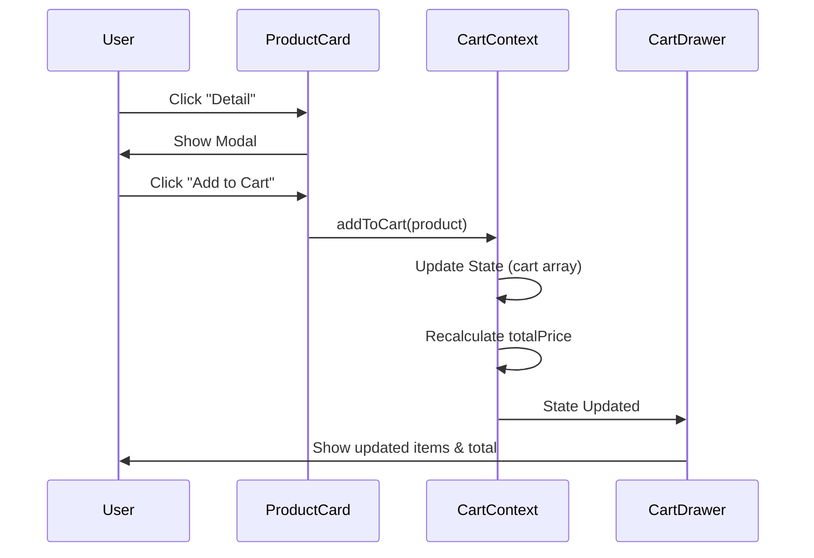
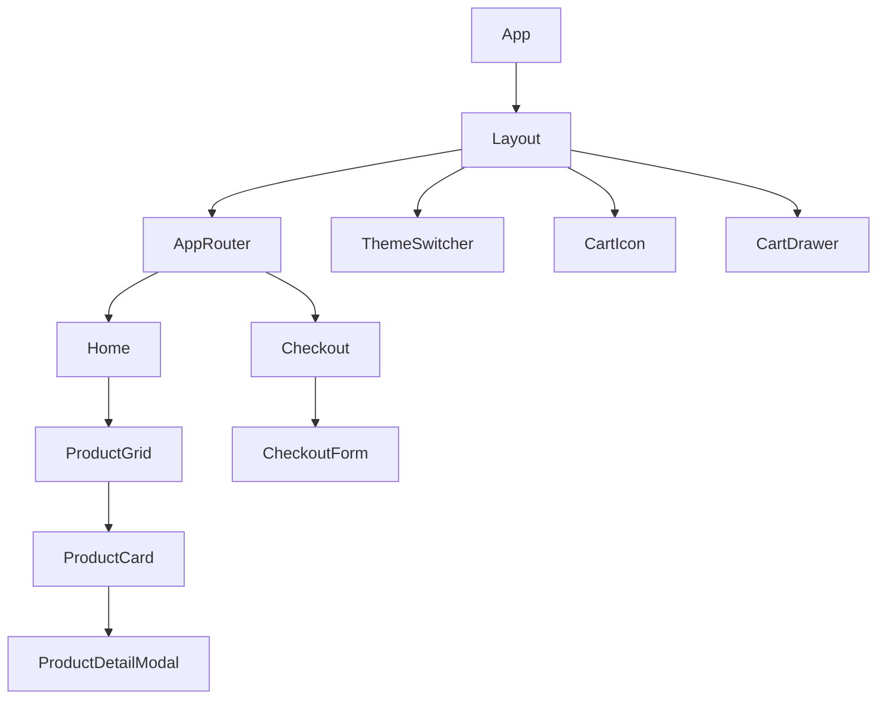

# Documentación Técnica del Proyecto

## 1. Visión General

Esta aplicación es un E-commerce SPA (Single Page Application) desarrollado con React, diseñado para ser modular, escalable y mantenible. Utiliza una arquitectura basada en **Features** para separar responsabilidades y **BEM** + **Tailwind CSS** para un sistema de diseño consistente.

## 2. Pila Tecnológica

-   **Core**: React 18, Vite.
-   **Lenguaje**: JavaScript (ES6+), JSX.
-   **Estilos**: Tailwind CSS, Metodología BEM (vía `@apply`), Material Tailwind (componentes UI).
-   **Enrutamiento**: React Router v6.
-   **Gestión de Estado**: React Context API (`CartContext`, `ThemeContext`).
-   **Iconos**: React Icons (sustituyendo SVGs inline).
-   **Consumo de API**: `fetch` nativo hacia DummyJSON.

## 3. Arquitectura del Software

### 3.1 Estructura de Carpetas (Feature-Based)

El proyecto se organiza por dominios funcionales (charasterísticas) en lugar de por tipos de archivo.

```
src/
├── features/               # Módulos principales de negocio
│   ├── cart/               # Gestión del Carrito
│   │   ├── application/    # Lógica de negocio (Context, Hooks)
│   │   └── presentation/   # Componentes UI (Cart, CartIcon)
│   ├── checkout/           # Proceso de Pago
│   │   ├── application/    # Hooks específicos de checkout
│   │   └── presentation/   # Páginas y formularios de pago
│   └── products/           # Catálogo de Productos
│       ├── application/    # useProducts (Casos de uso)
│       ├── infrastructure/ # productsApi (Adaptadores API)
│       └── presentation/   # Grid, Card, Modales
├── components/
│   └── common/             # Componentes reutilizables globales (Layout, Loader)
├── context/                # Contextos globales (ThemeContext)
├── pages/                  # Páginas de alto nivel (Home)
├── routes/                 # Configuración de rutas (AppRouter) NO IMPLEMENTADO AÚN, está en root como AppRouter.jsx
└── utils/                  # Utilidades compartidas (validaciones)
```

### 3.2 Patrones de Diseño Aplicados

-   **Container/Presenter Pattern**: Separación entre lógica (`useProducts`, `CartContext`) y vista (`ProductGrid`, `Cart`).
-   **Custom Hooks**: Encapsulamiento de lógica de estado (`useProducts`).
-   **Context API + Provider Pattern**: Para estado global (Carrito, Tema).
-   **Atomic Design (Simplificado)**: Componentes pequeños (`CartIcon`) componen organismos mayores (`Layout`).

## 4. Flujo de Datos

### 4.1 Carrito de Compras

1. **Acción**: Usuario hace clic en "Add to Cart".
2. **Context**: `addToCart` en `CartContext` recibe el producto.
3. **Estado**: Se actualiza el array `cart`.
4. **Cálculo Derivado**: `totalPrice` se recalcula automáticamente usando `useMemo`.
5. **Persistencia**: (Pendiente de implementación: localStorage).

### 4.2 Carga de Productos

1. **Inicio**: `Home` monta y llama a `useProducts`.
2. **Infraestructura**: `useProducts` llama a `productsApi.js`.
3. **API**: Petición GET a `dummyjson.com/products`.
4. **Estado**: `useProducts` gestiona `loading`, `error` y `data`.
5. **UI**: `Home` renderiza `SkeletonGrid` o `ProductGrid` según el estado.

## 5. Decisiones de Diseño Clave

### 5.1 Estilos (BEM + Tailwind)

Se decidió evitar el "soup de clases" típico de Tailwind en el JSX.

-   **Decisión**: Usar `@apply` en `index.css` definiendo clases semánticas BEM.
-   **Beneficio**: HTML limpio, semántico y estilos reutilizables.
-   **Ejemplo**: `.product-card` en lugar de `w-full max-w-sm mx-auto bg-white...`.

### 5.2 Lazy Loading

-   **Implementación**: `React.lazy` y `Suspense` en `AppRouter`.
-   **Objetivo**: Reducir el tamaño del bundle inicial cargando `Checkout` solo cuando es necesario.

## 6. Diagramas (Mermaid)

### 6.1 Flujo de Carrito



### 6.2 Arquitectura de Componentes



## 7. Métricas de Calidad Sugeridas

-   **Lighthouse**: Mantener Score > 90 en Performance y Accesibilidad.
-   **Bundle Size**: Monitorizar el tamaño de los chunks generados por Vite.
-   **Code Coverage**: (Futuro) Implementar tests unitarios con Jest/Vitest > 70%.

## 8. Riesgos y Mitigaciones

-   **Riesgo**: Dependencia de API externa (DummyJSON).
    -   _Mitigación_: Capa de adaptador en `infrastructure/productsApi.js` permite cambiar de proveedor fácilmente.
-   **Riesgo**: Estado del carrito se pierde al recargar.
    -   _Mitigación_: Implementar `localStorage` en `CartContext` (TODO).
