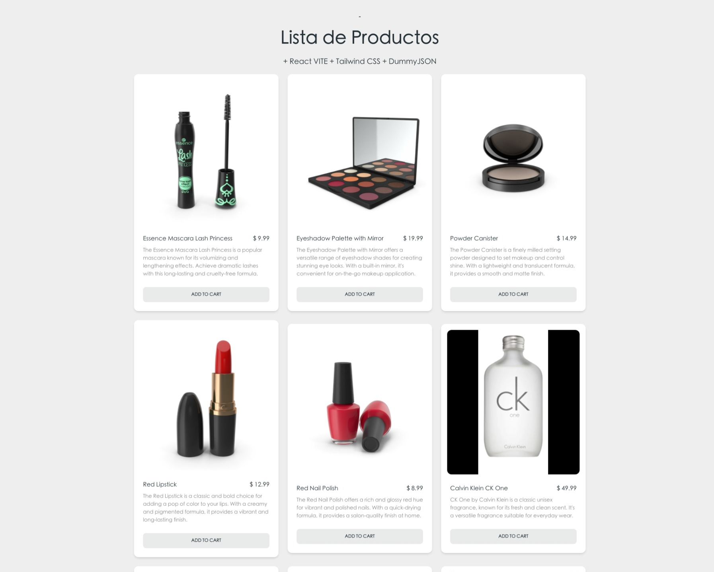

# 🛍️ Prototipo de E-Commerce con React y Arquitectura Limpia



Este proyecto es un prototipo funcional y de alto rendimiento de una aplicación de comercio electrónico, construida con **React**, **Vite** y **Tailwind CSS**. La base del código sigue principios de **Arquitectura Limpia** y un diseño modular basado en **funcionalidades (*features*)**, lo que garantiza que el proyecto sea escalable y fácil de mantener.

---

## 📚 Documentación del Proyecto

Hemos preparado una documentación detallada para diferentes audiencias.

| Documento                                           | Audiencia        | Descripción                                                                                                |
| :---------------------------------------------------- | :--------------- | :--------------------------------------------------------------------------------------------------------- |
| 📄 **[Resumen Ejecutivo](./src/docs/PROJECT_OVERVIEW.md)** | **Cliente / Negocio** | Visión general del proyecto, beneficios clave, casos de uso y KPIs sugeridos para el éxito del negocio.    |
| 🛠️ **[Especificación Técnica](./src/docs/TECHNICAL_SPECIFICATION.md)** | **Técnica / Desarrollo** | Análisis profundo de la arquitectura, patrones de diseño, diagramas UML, tecnologías y nivel de complejidad. |

---

## 🚀 Cómo Empezar

Sigue estos pasos para ejecutar el proyecto en tu entorno local.

### Prerrequisitos
-   Node.js (versión 16 o superior)
-   npm o pnpm como gestor de paquetes

### Instalación

1.  **Clona el repositorio:**
    ```bash
    git clone https://github.com/yourusername/myprojectapi12.git
    cd myprojectapi12
    ```

2.  **Instala las dependencias:**
    ```bash
    npm install
    ```

3.  **Ejecuta el servidor de desarrollo:**
    ```bash
    npm run dev
    ```
    La aplicación estará disponible en `http://localhost:5173` (o el puerto que Vite asigne).

---

## 🏛️ Arquitectura Aplicada

La aplicación se estructura en torno a una **Arquitectura Basada en Funcionalidades (*Feature-Based Architecture*)**. En lugar de agrupar el código por tipo de archivo (ej. `components`, `hooks`), lo organizamos por dominio de negocio (ej. `features/cart`, `features/products`).

### Beneficios de esta Arquitectura:
-   **Alta Cohesión:** El código relacionado con una misma funcionalidad reside en el mismo lugar.
-   **Bajo Acoplamiento:** Las funcionalidades son independientes entre sí, lo que facilita su modificación o eliminación.
-   **Escalabilidad:** Añadir nuevas funcionalidades es tan simple como crear una nueva carpeta dentro de `features`, sin afectar el resto de la aplicación.

Para un análisis detallado, consulta la [Especificación Técnica](./src/docs/TECHNICAL_SPECIFICATION.md).

---

## ✨ Características Principales

-   **Arquitectura Limpia:** Separación estricta entre la lógica de negocio (Custom Hooks) y la presentación (Componentes).
-   **Carga Optimizada:** Uso de `React.lazy` y `Suspense` para dividir el código por rutas y acelerar la carga inicial.
-   **Diseño Responsivo:** Interfaz adaptada para una correcta visualización en dispositivos móviles y de escritorio.
-   **Modo Oscuro y Claro:** Selector de tema integrado para mejorar la experiencia de usuario.
-   **Estilos Semánticos:** Combinación de **Tailwind CSS** con la metodología **BEM** para un JSX limpio y un CSS mantenible.