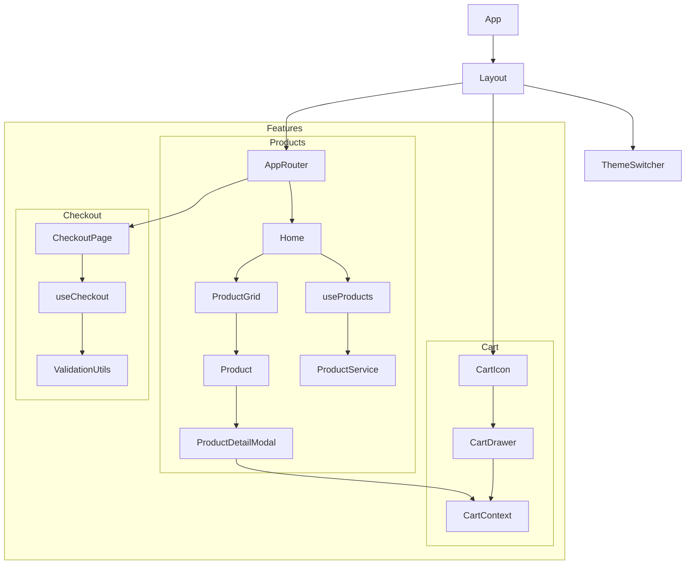

# 📘 Documento Técnico del Software

## 1. Visión General

Este documento describe la arquitectura técnica, los flujos de datos y las decisiones de diseño del proyecto E-Commerce. El sistema está diseñado para ser modular, escalable y fácil de mantener.

## 2. Arquitectura del Sistema

### 2.1 Diagrama de Componentes (Alto Nivel)

### 2.2 Patrones de Diseño

-   **Container/Presentational**: Separación entre lógica (Hooks) y UI (Componentes).
-   **Observer Pattern**: Implementado a través de React Context (`CartContext`, `ThemeContext`) para notificar cambios de estado a los componentes suscritos.
-   **Module Pattern**: Encapsulamiento de lógica por features.

## 3. Flujo de Datos

### 3.1 Flujo de Compra

1.  **Selección**: El usuario selecciona un producto (`Product.jsx`).
2.  **Estado Global**: `addToCart` actualiza el `CartContext`.
3.  **Persistencia**: El estado del carrito vive en memoria durante la sesión.
4.  **Checkout**:
    -   El usuario navega a `/checkout`.
    -   `useCheckout` inicializa el estado del formulario.
    -   Se validan los inputs en tiempo real (`utils/validation.js`).
    -   Al confirmar, se simula el pago y se redirige a `/checkout-success`.

### 3.2 Fetching de Datos

-   **Estrategia**: Client-side fetching.
-   **Hook**: `useProducts` maneja el ciclo de vida de la petición.
-   **Paginación & Deduplicación**:
    -   Implementada con `skip` y `limit` en la API.
    -   **Smart Caching**: Usa `new Set()` para filtrar IDs duplicados instantáneamente (O(1)) antes de actualizar el estado, garantizando integridad visual y de datos.
    -   **Acumulación**: Estado basado en acumulación (`[...prev, ...new]`) para soportar "Cargar más" sin perder contexto.

## 4. Requerimientos No Funcionales

-   **Rendimiento**:
    -   First Contentful Paint (FCP) < 1.5s.
    -   Implementación de `React.lazy` para dividir el bundle.
    -   Uso de `React.memo` en componentes de lista (`Product.jsx`).
-   **Escalabilidad**: Arquitectura basada en features permite agregar nuevos módulos sin refactorizar el núcleo.
-   **Mantenibilidad**: Código documentado con JSDoc y tipado con PropTypes.

## 5. Métricas de Calidad

-   **Complejidad Ciclomática**: Mantenida baja al extraer lógica compleja a hooks y utilidades.
-   **Duplicación de Código**: < 5% gracias a componentes reutilizables (`Input`, `Button` wrappers).

## 6. Riesgos y Mitigaciones

| Riesgo                           | Impacto                    | Mitigación                                                         |
| :------------------------------- | :------------------------- | :----------------------------------------------------------------- |
| **Fallo de API Externa**         | Alto (No se ven productos) | Manejo de errores en `useProducts` y UI de error amigable.         |
| **Performance en Listas Largas** | Medio (Lag en scroll)      | Paginación implementada y virtualización (futuro).                 |
| **Estado Inconsistente**         | Medio                      | Reducers puros para manejo de estado complejo (`checkoutReducer`). |

## 7. APIs Utilizadas

-   **DummyJSON**: `https://dummyjson.com/products`
    -   `GET /products?limit=20&skip=0`
