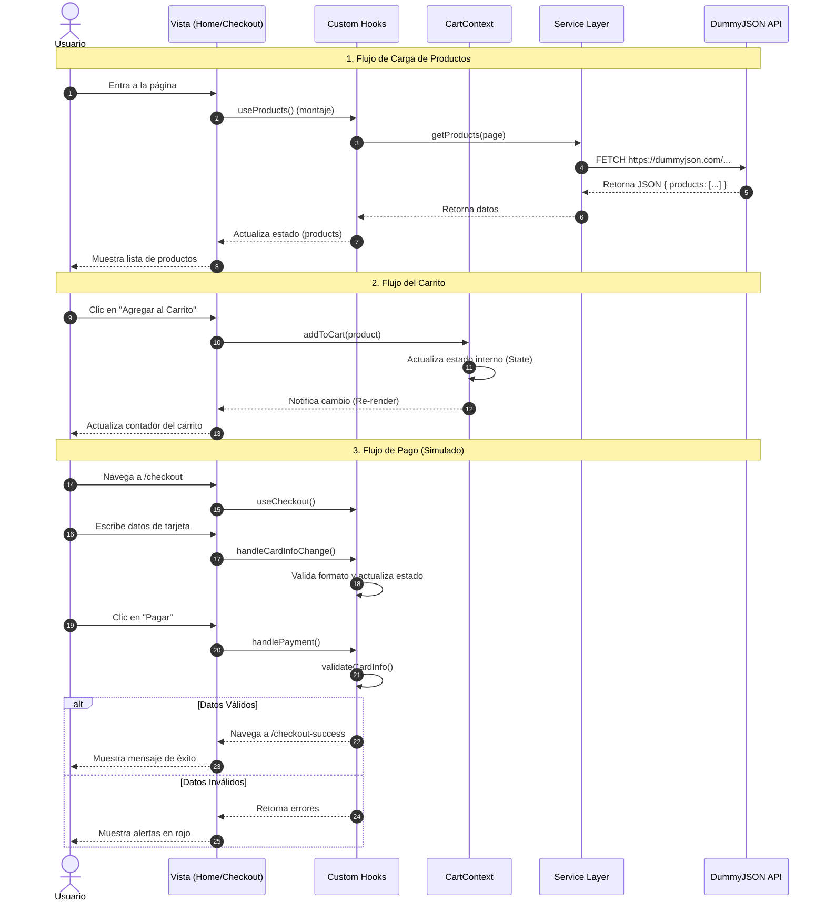

# 🎓 Tutorial Completo: Creando un E-Commerce Profesional con React

Este tutorial te guiará paso a paso para entender, recrear y extender este proyecto. Aprenderás patrones avanzados de React y arquitectura de software.

## 📚 Tabla de Contenidos
1.  [Configuración del Entorno](#1-configuración-del-entorno)
2.  [Arquitectura del Proyecto](#2-arquitectura-del-proyecto)
3.  [Configuración del Punto de Entrada](#3-configuración-del-punto-de-entrada-mainjsx)
4.  [Creando la Feature de Productos](#4-creando-la-feature-de-productos)
5.  [Gestión del Estado Global (Carrito)](#5-gestión-del-estado-global-carrito)
6.  [Implementando el Checkout (Lógica Avanzada)](#6-implementando-el-checkout-lógica-avanzada)
7.  [Optimizaciones y Buenas Prácticas](#7-optimizaciones-y-buenas-prácticas)

---

## 1. Configuración del Entorno

Comenzamos con Vite, una herramienta de build extremadamente rápida.

```bash
npm create vite@latest my-ecommerce -- --template react
cd my-ecommerce
npm install
npm install -D tailwindcss postcss autoprefixer
npx tailwindcss init -p
```

### Configurando Tailwind y BEM
En lugar de llenar nuestro JSX de clases utilitarias, usaremos la directiva `@apply` en `src/index.css` para crear clases semánticas siguiendo BEM (Block Element Modifier).

**Ejemplo:**
```css
/* Block */
.product-card {
    @apply bg-white rounded-lg shadow-md overflow-hidden;
}

/* Element */
.product-card__title {
    @apply font-bold text-lg mb-2;
}

/* Modifier */
.product-card__button--disabled {
    @apply opacity-50 cursor-not-allowed;
}
```

---

## 2. Arquitectura del Proyecto

No tires todos tus archivos en `src/components`. Usaremos una **Feature-Based Architecture**.

Crea la siguiente estructura:
- `src/components/common`: Componentes genéricos reutilizables (Layouts, Botones globales).
- `src/features/products`: Todo lo relacionado a ver productos.
- `src/features/cart`: Todo lo relacionado al carrito de compras.
- `src/features/checkout`: Todo lo relacionado al pago.

Esto mantiene tu código limpio y fácil de navegar.

### Flujo de Datos

El siguiente diagrama de secuencia ilustra cómo fluyen los datos a través de los componentes, hooks y servicios de la aplicación:



---

## 3. Configuración del Punto de Entrada (`main.jsx`)

Es crucial configurar correctamente los proveedores de contexto y el enrutador en el punto de entrada de la aplicación. Esto asegura que el estado global (como el tema o el carrito) esté disponible en todo el árbol de componentes.

```javascript
// src/main.jsx
import React from "react";
import ReactDOM from "react-dom/client";
import { BrowserRouter } from "react-router-dom";
import { ThemeProvider } from "@/context/ThemeContext";
import { CartProvider } from "@/features/cart/context/CartContext";
import App from "./App.jsx";
import "./index.css";

ReactDOM.createRoot(document.getElementById("root")).render(
    <React.StrictMode>
        {/* Router debe envolver a la app para que funcionen las rutas */}
        <BrowserRouter basename="/myprojectapi12/">
            {/* Los Providers envuelven a la App para dar acceso al estado global */}
            <ThemeProvider>
                <CartProvider>
                    <App />
                </CartProvider>
            </ThemeProvider>
        </BrowserRouter>
    </React.StrictMode>
);
```

---

## 4. Creando la Feature de Productos

### El Servicio (`products.js`)
Primero, definimos cómo obtener los datos. Separar esto de la UI nos permite cambiar la API fácilmente en el futuro.

```javascript
// src/features/products/services/products.js
export const getProducts = async (page) => {
    const response = await fetch(`https://dummyjson.com/products?limit=20&skip=${page * 20}`);
    return await response.json();
};
```

### El Custom Hook (`useProducts.js`)
Creamos un hook para manejar la lógica de carga, error y paginación. **Nunca escribas `useEffect` con fetch directamente en tu componente UI.**

```javascript
// src/features/products/hooks/useProducts.js
export const useProducts = () => {
    const [products, setProducts] = useState([]);
    // ... lógica de estado ...
    return { products, loading, error, loadMore };
};
```

---

## 5. Gestión del Estado Global (Carrito)

Usamos **Context API** para que el carrito sea accesible desde cualquier parte de la app.

**Clave:** Usa un `CartProvider` que envuelva tu aplicación en `main.jsx`.

```javascript
// src/features/cart/context/CartContext.jsx
export const CartProvider = ({ children }) => {
    const [cart, setCart] = useState([]);

    const addToCart = (product, quantity) => {
        // Lógica para agregar o actualizar cantidad
    };

    return (
        <CartContext.Provider value={{ cart, addToCart }}>
            {children}
        </CartContext.Provider>
    );
};
```

---

## 6. Implementando el Checkout (Lógica Avanzada)

El formulario de checkout es complejo. Tiene validaciones, muchos campos y diferentes métodos de pago.

**Mala Práctica:** Poner toda la lógica dentro de `Checkout.jsx`.
**Buena Práctica:** Extraer la lógica a `useCheckout.js`.

Usamos `useReducer` en lugar de múltiples `useState` para manejar el estado complejo del formulario de manera predecible.

```javascript
// src/features/checkout/hooks/useCheckout.js
function checkoutReducer(state, action) {
    switch (action.type) {
        case 'SET_FIELD_VALUE':
            return { ...state, cardInfo: { ...state.cardInfo, [action.payload.name]: action.payload.value } };
        // ... otros casos
    }
}
```

---

## 7. Optimizaciones y Buenas Prácticas

### Lazy Loading
Para que la app cargue rápido, no descargamos el código de "Checkout" hasta que el usuario vaya a esa página.

```javascript
// src/AppRouter.jsx
const Checkout = lazy(() => import('@/features/checkout/pages/Checkout'));

<Suspense fallback={<Spinner />}>
    <Route path="/checkout" element={<Checkout />} />
</Suspense>
```

### PropTypes
Siempre valida las props que reciben tus componentes. Es como TypeScript "light" y te salva de muchos errores.

```javascript
Product.propTypes = {
    product: PropTypes.shape({
        id: PropTypes.number.isRequired,
        title: PropTypes.string.isRequired,
    }).isRequired,
};
```

---

¡Felicidades! Has construido una aplicación robusta y escalable.
