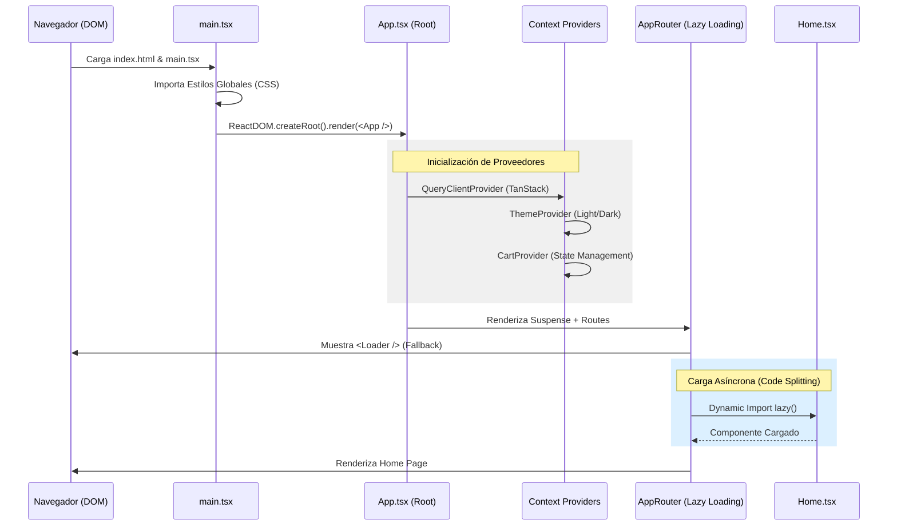
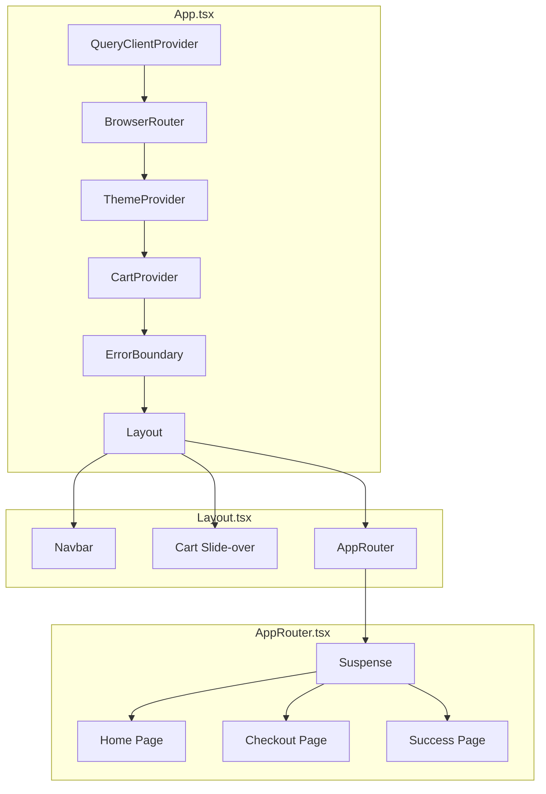
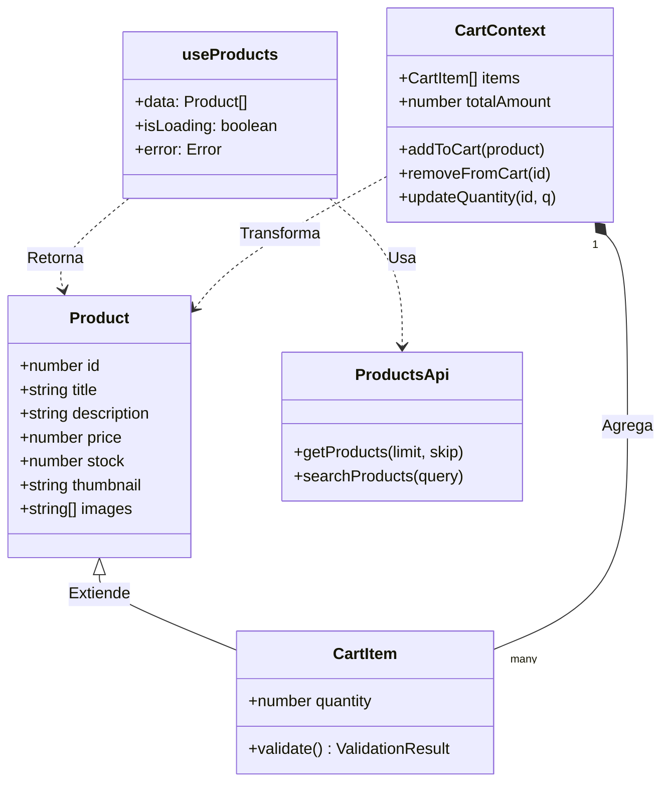
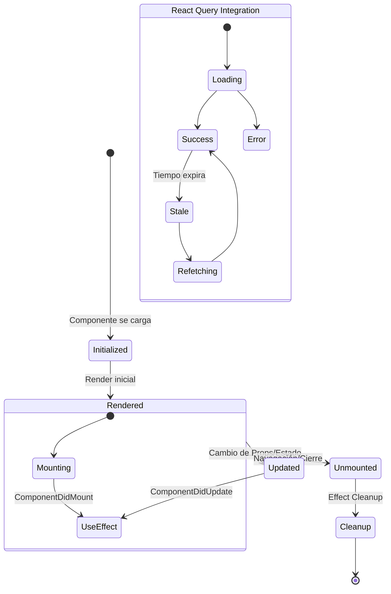
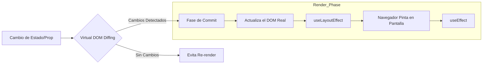

# Diagramas de Arquitectura y Flujo - Proyecto API12

Este documento contiene la representación visual de la arquitectura, ciclos de vida y flujos de ejecución del proyecto utilizando **Mermaid**.

## 1. Secuencia de Ejecución y Bootstrapping
Describe el proceso desde que el navegador carga la aplicación hasta el renderizado de la página principal.



---

## 2. Jerarquía de Componentes
Organización estructural de la UI y los proveedores de estado.



---

## 3. Diagrama de Clases UML (Dominio)
Relaciones entre las entidades de datos y la lógica de negocio.



---

## 4. Diagrama de Componentes (Capas)
Visión de arquitectura hexagonal / por capas.

```mermaid
componentDiagram
    package "Presentation Layer" {
        [Pages (Home, Checkout)] <<Component>>
        [UI Components (Button, Card)] <<Component>>
    }

    package "Application Layer" {
        [Contexts (Cart, Theme)] <<Service>>
        [Hooks (useProducts, useCart)] <<Logic>>
    }

    package "Domain Layer" {
        [Entities (Product, CartItem)] <<Entity>>
        [Validation Logic] <<Utility>>
    }

    package "Infrastructure Layer" {
        [ApiClient (Axios/Fetch)] <<Interface>>
        [QueryClient (TanStack)] <<Cache>>
    }

    [Pages] --> [Hooks]
    [Hooks] --> [Contexts]
    [Hooks] --> [ApiClient]
    [Contexts] --> [Entities]
    [ApiClient] --> [External API (DummyJSON)]
```

---

## 5. Ciclo de Vida del Componente y Datos
Estados de React Query e integración con el ciclo de vida de React.



---

## 6. Flujo de Renderización
Cómo React maneja las actualizaciones en el DOM.



---

## 7. Diagrama de Despliegue
Infraestructura física de la solución.

```mermaid
deploymentDiagram
    node "Cliente (Browser)" {
        artifact "React App (JS/HTML/CSS)"
    }

    node "GitHub Pages (CDN)" {
        [Build Artifacts]
    }

    node "DummyJSON API" {
        [Product Service]
    }

    [Cliente] -- "HTTPS" --> [GitHub Pages] : Descarga App
    [Cliente] -- "REST/JSON" --> [DummyJSON API] : Consume Datos
```
