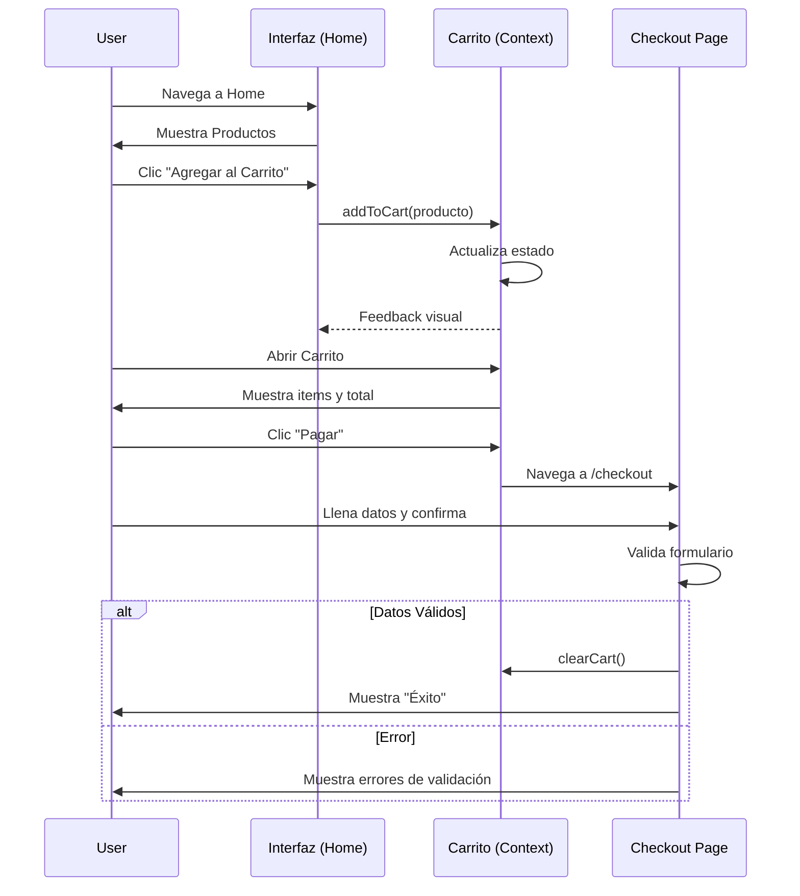

# Casos de Uso del Sistema

## 1. Actores y Roles

-   **Usuario Visitante (Guest):** Persona que navega por la tienda sin necesidad de autenticación previa.
-   **Sistema (System):** Backend simulado y lógica de frontend que procesa las solicitudes.

## 2. Mapa de Casos de Uso

| ID        | Nombre del Caso de Uso              | Actor Principal   | Prioridad |
| :-------- | :---------------------------------- | :---------------- | :-------- |
| **CU-01** | Visualizar Catálogo de Productos    | Usuario Visitante | Alta      |
| **CU-02** | Ver Detalle de Producto             | Usuario Visitante | Media     |
| **CU-03** | Agregar Producto al Carrito         | Usuario Visitante | Alta      |
| **CU-04** | Gestionar Carrito (Eliminar/Vaciar) | Usuario Visitante | Media     |
| **CU-05** | Realizar Checkout (Pago)            | Usuario Visitante | Alta      |
### CU-06: Cambiar Tema (Oscuro/Claro)

**Descripción:** El usuario puede cambiar la apariencia visual de la aplicación entre un tema claro y uno oscuro.

-   **Flujo Principal:**
    1.  El usuario hace clic en el interruptor de tema.
    2.  El sistema invoca `toggleTheme` en `ThemeContext`.
    3.  El sistema aplica la clase `dark` al `<html>` y actualiza las variables CSS.
    4.  La UI se repinta instantáneamente con el nuevo esquema de colores.
-   **Regla de Negocio:**
    -   El cambio de tema afecta los colores base y la apariencia de los componentes con estilo Neumorfista, como las tarjetas.
-   **Postcondición:** La preferencia se guarda en `localStorage` para futuras visitas.

---

## 3. Especificación Detallada de Flujos

### CU-01: Visualizar Catálogo de Productos

**Descripción:** El sistema muestra una lista paginada de productos disponibles.

-   **Precondición:** El usuario accede a la ruta `/` (Home).
-   **Flujo Principal:**
    1.  El sistema detecta la carga de la página.
    2.  `useProducts` solicita datos a la API.
    3.  El sistema muestra indicadores de carga (`SkeletonGrid`).
    4.  El sistema renderiza la grilla de productos (`ProductGrid`).
    5.  El usuario hace scroll y solicita más productos ("Cargar más").
-   **Flujo Alterno (Error de Red):**
    1.  La API falla o retorna 500.
    2.  El sistema muestra un mensaje de error amigable en la UI.

### CU-03: Agregar Producto al Carrito

**Descripción:** El usuario añade un artículo para su compra futura.

-   **Flujo Principal:**
    1.  Usuario hace clic en "Add to Cart" en una tarjeta o modal.
    2.  El sistema valida el stock disponible (simulado).
    3.  El sistema actualiza el estado global `cart` en `CartContext`.
    4.  El sistema muestra una notificación visual o abre el Drawer del carrito.
    5.  El sistema recalcula el subtotal automáticamente.

### CU-05: Realizar Checkout (Pago)

**Descripción:** Proceso de finalización de compra.

-   **Precondición:** El carrito no debe estar vacío.
-   **Flujo Principal:**
    1.  Usuario hace clic en "Checkout" desde el Carrito.
    2.  El sistema navega a `/checkout`.
    3.  Usuario selecciona método de pago (Visa, Mastercard, Bitcoin).
    4.  Usuario completa los datos de la tarjeta.
    5.  Usuario confirma el pago.
    6.  El sistema valida formato de tarjeta (Luhn, longitud).
    7.  El sistema muestra pantalla de "Éxito" y limpia el carrito.
-   **Reglas de Negocio:**
    -   No se pueden ingresar caracteres no numéricos en el campo de tarjeta.
    -   La fecha de expiración debe ser futura.

---

## 4. Diagrama de Flujo (Mermaid)

