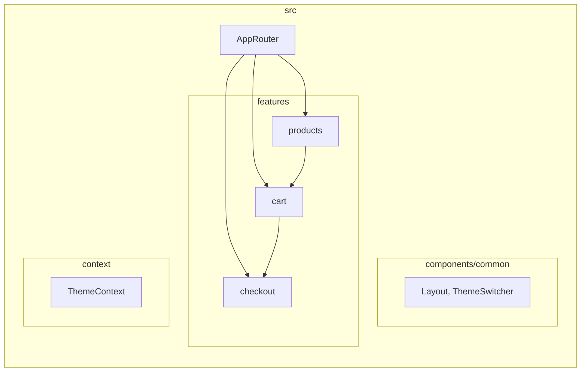
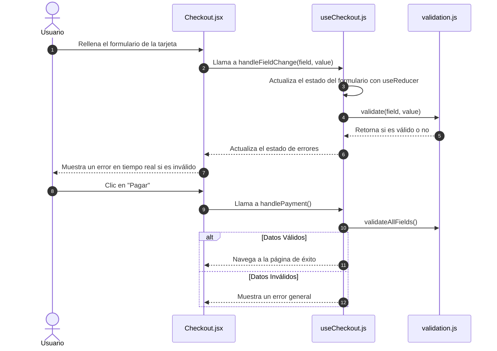

# Guion para Exposición: Arquitectura de un E-Commerce Moderno con React

## Diapositiva 1: Título

### Arquitectura de un E-Commerce Moderno con React

Análisis de un prototipo escalable, mantenible y de alto rendimiento.

---

## Diapositiva 2: Introducción ¿Qué es este proyecto?

Este proyecto es un prototipo funcional de una tienda online construido con tecnologías de vanguardia.

**Su objetivo principal no es vender productos, sino demostrar una arquitectura de software robusta y profesional.**

Es una base de código que sirve como plantilla para construir aplicaciones React complejas, siguiendo las mejores prácticas de la industria para garantizar que el software sea:

- **Escalable:** Fácil de crecer sin caos.
- **Mantenible:** Sencillo de entender y modificar.
- **Eficiente:** Rápido y con una excelente experiencia de usuario.

---

## Diapositiva 3: Agenda

1. **La Experiencia de Usuario:** Un vistazo al flujo de compra.
2. **Arquitectura del Sistema:** El plano de nuestra aplicación.
3. **Pila Tecnológica:** Las herramientas que lo hacen posible.
4. **Patrones de Diseño Clave:** El "porqué" de nuestra estructura.
5. **Análisis de un Flujo Crítico:** El proceso de Checkout.
6. **Conclusiones:** Beneficios y próximos pasos.

---

## Diapositiva 4: La Experiencia de Usuario (Casos de Uso)

El usuario puede completar un flujo de compra de principio a fin. Esto se traduce en los siguientes casos de uso principales:

```mermaid
graph TD
    actor Cliente
    subgraph "Plataforma E-Commerce"
        uc1["Explorar Catálogo de Productos"]
        uc2["Gestionar Carrito de Compras"]
        uc3["Realizar Proceso de Pago"]
        uc4["Ver Detalles de un Producto"]
    end

    Cliente -- uc1
    Cliente -- uc2
    Cliente -- uc3

    uc1 --|> uc4 : include
    uc3 --|> uc2 : include
```

---

## Diapositiva 5: Arquitectura General del Sistema

Adoptamos una **Arquitectura Limpia adaptada a React**, organizada por funcionalidades (*features*).

Esto significa que el código no se agrupa por tipo de archivo, sino por **dominio de negocio**.



- **Features:** Módulos autocontenidos (Productos, Carrito, Checkout).
- **Components/common:** Componentes de UI reutilizables en toda la app.
- **Context:** Estado global de la aplicación.
- **AppRouter:** Orquesta qué página se muestra.

---

## Diapositiva 6: Pila Tecnológica

| Categoría         | Tecnología / Librería        | Rol en el Proyecto                                       |
| :---------------- | :--------------------------- | :------------------------------------------------------- |
| **Core Framework**| React 18                     | Construcción de la interfaz de usuario.                  |
| **Build Tool**    | Vite                         | Desarrollo y empaquetado ultra rápido.                   |
| **Enrutamiento**  | React Router DOM             | Navegación dentro de la Single Page Application (SPA).   |
| **UI y Estilos**  | Tailwind CSS, Material Tailwind & Neumorfismo | Diseño rápido con utilidades, componentes Material y estética Neumorfista. |
| **Estado Global** | React Context                | Gestión de estado compartido (Carrito, Tema).            |
| **Calidad Código**| ESLint                       | Mantenimiento de un código limpio y consistente.         |

---

## Diapositiva 7: Patrón Clave 1 - Arquitectura por Funcionalidades

**El problema:** En proyectos grandes, las carpetas genéricas como `/components` o `/hooks` se vuelven caóticas. ¿Dónde está la lógica del carrito? ¿Y la del perfil de usuario?

**La solución:** Agrupar el código por su **dominio de negocio**.

**`src/features/`**

- `/cart`
- `/products`
- `/checkout`

**Beneficios:**

1. **Cohesión Alta:** Todo lo relacionado con el carrito está en un solo lugar.
2. **Acoplamiento Bajo:** Modificar el checkout no rompe la lógica de los productos.
3. **Escalabilidad:** Añadir una nueva funcionalidad (ej. "Lista de Deseos") es tan fácil como crear una nueva carpeta.

---

## Diapositiva 8: Patrón Clave 2 - Separación de Lógica y UI

Hemos separado estrictamente la **Lógica de Negocio** de la **Interfaz de Usuario**.

- **Componentes React (`.jsx`):** Son "tontos". Su única misión es renderizar la UI basada en las `props` que reciben y emitir eventos (ej. `onClick`). No contienen lógica de negocio.

- **Custom Hooks (`.js`):** Son "inteligentes". Contienen toda la lógica: `fetch` de datos, manejo de estado (`useState`, `useReducer`), validaciones y efectos secundarios (`useEffect`).

**Ejemplo:** `Checkout.jsx` (UI) usa `useCheckout.js` (Lógica). El formulario solo muestra errores; el hook decide *cuándo* hay un error.

**Resultado:** Componentes reutilizables y lógica fácilmente testeable de forma aislada.

---

## Diapositiva 9: Flujo Crítico - El Proceso de Checkout

El siguiente diagrama de secuencia ilustra cómo interactúan las capas de la aplicación durante el pago.



---

## Diapositiva 10: Conclusiones

Esta arquitectura nos proporciona beneficios tangibles:

- **Mantenibilidad:** Encontrar y corregir bugs es rápido porque el código está organizado por dominio.
- **Escalabilidad:** El sistema está preparado para crecer con nuevas funcionalidades sin necesidad de grandes refactorizaciones.
- **Onboarding Rápido:** Un nuevo desarrollador puede entender una funcionalidad completa trabajando dentro de una única carpeta.

**Próximos Pasos Sugeridos:**

1. **Testing:** Implementar tests unitarios y de integración.
2. **Backend Real:** Conectar con una API real para persistencia de datos.
3. **Autenticación:** Añadir un sistema de login de usuarios.

---

## Diapositiva 11: Fin

### ¿Preguntas?

Gracias por su atención.
