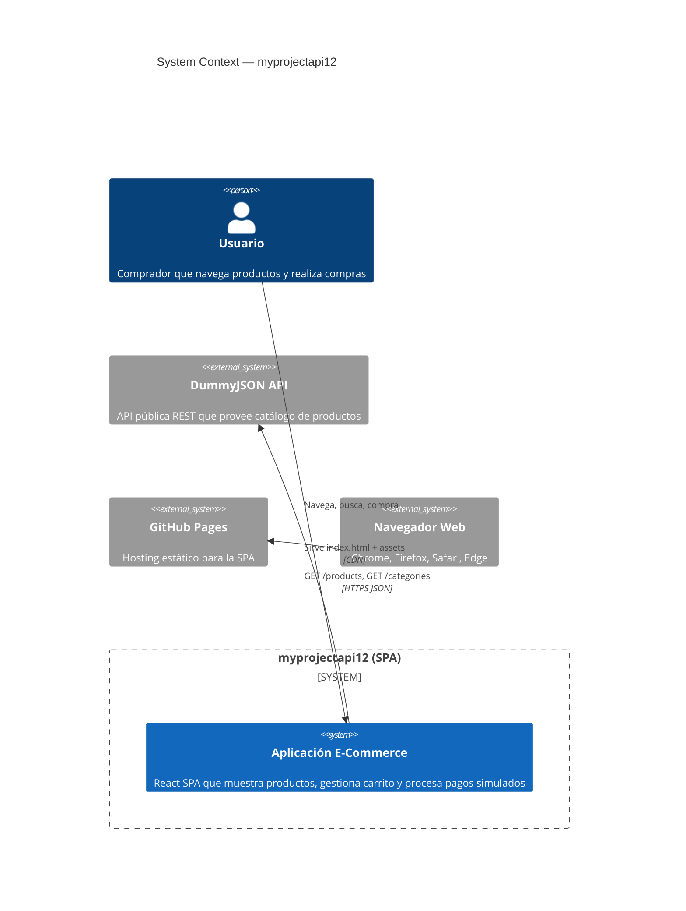
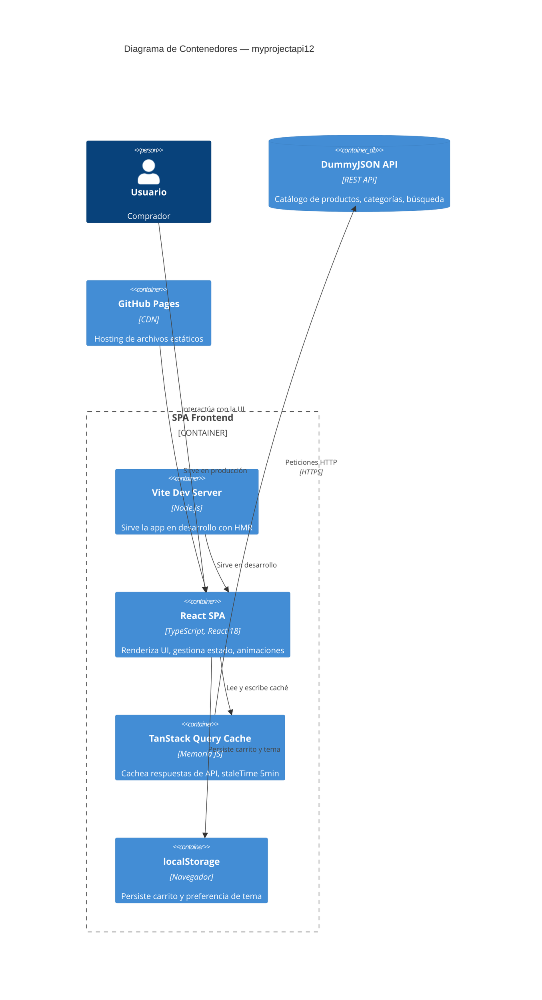
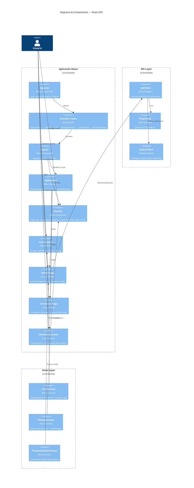
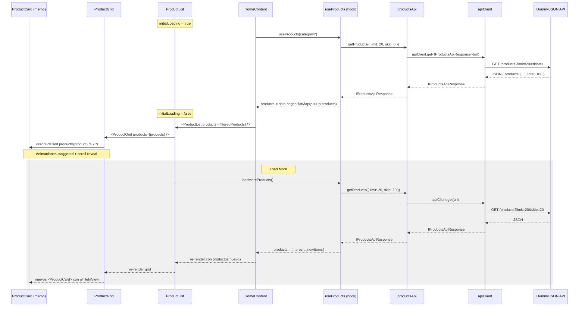

# Modelo C4 de Arquitectura

Diagramas de arquitectura basados en el modelo C4 (*Context, Container, Component, Code*) de Simon Brown.

---

## Nivel 1: Diagrama de Contexto (System Context)

Muestra el sistema software y sus interacciones con actores y sistemas externos.

## Nivel 2: Diagrama de Contenedores (Containers)

Muestra los contenedores que ejecutan el sistema y sus responsabilidades.

## Nivel 3: Diagrama de Componentes (Components)

Muestra los componentes principales de React y cómo se relacionan.

## Nivel 4: Diagrama de Código (Code)

Ejemplo concreto del flujo de carga de productos, desde el componente hasta la API.

