# Mapa de Dependencias

Grafo de dependencias entre capas, módulos y componentes. Validación contra dependencias circulares.

---

## Reglas de Dependencia (FSD)

La arquitectura Feature-Sliced Design impone las siguientes reglas:

```
pages → features → shared
app → features → shared
shared → (no depende de nadie)
features ←/→ features (no dependencias cruzadas entre features)
```

---

## Grafo de Dependencias por Módulo

```mermaid
flowchart TB
  subgraph Entry["Entry Points"]
    index["index.html"]
    main["main.tsx"]
  end

  subgraph App["Capa App (src/app/)"]
    app["App.tsx"]
    router["AppRouter.tsx"]
    apiClient["apiClient.ts"]
    env["env.ts"]
    queryClient["queryClient.ts"]
  end

  subgraph Pages["Capa Pages (src/pages/)"]
    home["Home.tsx"]
    homeContent["HomeContent.tsx"]
  end

  subgraph Shared["Capa Shared (src/shared/)"]
    http["httpClient.ts"]
    hooks["hooks/*"]
    ui["ui/*"]
    cn["cn.ts"]
    animations["animations.ts"]
    stock["stockUtils.ts"]
    routes["routes.ts"]
    queryKeys["queryKeys.ts"]
  end

  subgraph Features_Products["Feature Products"]
    productsTypes["domain/productTypes.ts"]
    productsApi["infrastructure/productsApi.ts"]
    useProducts["application/useProducts.ts"]
    useCategories["application/useCategories.ts"]
    useProductModal["application/useProductModal.ts"]
    productModalContext["application/ProductModalContext.ts"]
    productModalProvider["application/ProductModalProvider.ts"]
    productGrid["presentation/ProductGrid.tsx"]
    productCard["presentation/ProductCard.tsx"]
    productList["presentation/ProductList.tsx"]
    productModal["presentation/ProductDetailModal.tsx"]
    searchInput["presentation/components/SearchInput.tsx"]
    loadMore["presentation/components/LoadMoreSection.tsx"]
  end

  subgraph Features_Cart["Feature Cart"]
    cartTypes["domain/cartTypes.ts"]
    cartUtils["domain/cartUtils.ts"]
    cartContext["application/CartContext.tsx"]
    useCartActions["application/hooks/useCartActions.ts"]
    useCartDrawer["application/hooks/useCartDrawer.ts"]
    cartDrawer["presentation/Cart.tsx"]
    cartItemRow["presentation/CartItemRow.tsx"]
    cartFooter["presentation/CartFooter.tsx"]
  end

  subgraph Features_Checkout["Feature Checkout"]
    formatters["domain/formatters.ts"]
    checkoutReducer["application/checkoutReducer.ts"]
    useCheckout["application/useCheckout.ts"]
    useDiscount["application/useDiscountValidation.ts"]
    validation["application/validation.ts"]
    checkout["presentation/Checkout.tsx"]
    checkoutSuccess["presentation/CheckoutSuccess.tsx"]
    cardForm["presentation/components/CardForm.tsx"]
    orderSummary["presentation/components/OrderSummary.tsx"]
  end

  subgraph Features_Theme["Feature Theme"]
    themeContext["application/ThemeContext.tsx"]
    themeStorage["infrastructure/themeStorage.ts"]
    themeSwitcher["presentation/ThemeSwitcher.tsx"]
  end

  %% Entry Point Dependencies
  index --> main
  main --> app

  %% App Dependencies
  app --> queryClient
  app --> themeContext
  app --> cartContext
  app --> router

  router --> home
  router --> checkout
  router --> checkoutSuccess

  %% Page Dependencies
  home --> homeContent
  homeContent --> useProducts
  homeContent --> useCategories
  homeContent --> productModalContext
  homeContent --> searchInput

  %% Products Feature Internal
  useProducts --> productsApi
  useProducts --> productsTypes
  productsApi --> apiClient
  productsApi --> productsTypes
  apiClient --> env
  apiClient --> http

  productCard --> productsTypes
  productCard --> productModalContext
  productCard --> cartContext
  productCard --> stock

  productGrid --> productCard
  productGrid --> animations
  productList --> productGrid
  productList --> loadMore
  productModal --> cartContext
  productModal --> productsTypes

  useProductModal --> productModalContext

  %% Cart Feature Internal
  cartContext --> cartUtils
  cartContext --> useCartActions
  cartContext --> useCartDrawer
  useCartActions --> cartUtils
  cartDrawer --> cartContext
  cartDrawer --> cartItemRow
  cartDrawer --> cartFooter
  cartItemRow --> cartContext

  %% Checkout Feature Internal
  useCheckout --> checkoutReducer
  useCheckout --> validation
  useCheckout --> formatters
  useCheckout --> cartContext
  checkout --> useCheckout
  checkout --> useDiscount
  checkout --> cardForm
  checkout --> orderSummary
  checkoutSuccess --> cartTypes

  %% Theme Feature Internal
  themeContext --> themeStorage
  themeSwitcher --> themeContext

  %% Shared Dependencies
  homeContent --> hooks
  productCard --> hooks
  cartDrawer --> hooks
  checkout --> hooks
  checkoutSuccess --> hooks
  useCheckout --> routes
  router --> routes
  useProducts --> queryKeys

  %% UI Kit Consumers
  productCard --> ui
  cartDrawer --> ui
  checkout --> ui
  checkoutSuccess --> ui
  homeContent --> ui
```



## Validación de Dependencias Circulares

Se analizaron todas las rutas de importación del proyecto. **No se encontraron dependencias circulares.**

### Puntos críticos verificados

| Par | Dirección | ¿Circular? |
|---|---|---|
| CartContext ↔ useCartActions | CartContext → useCartActions → cartUtils | ✅ No circular |
| useCheckout ↔ checkoutReducer | useCheckout → checkoutReducer | ✅ No circular |
| productsApi ↔ useProducts | useProducts → productsApi → apiClient | ✅ No circular |
| CartContext ↔ cartDrawer | cartContext → cartDrawer (no, es al revés: cartDrawer → cartContext) | ✅ No circular |
| ThemeContext ↔ themeSwitcher | themeSwitcher → themeContext | ✅ No circular |
| ProductModalContext ↔ ProductModalProvider | ProductModalProvider → ProductModalContext | ✅ No circular |

### Dependencias entre features (verificación cruzada)

| Feature | ¿Depende de otra feature? | ¿Violación FSD? |
|---|---|---|
| **Cart** | Products (cartTypes importa IProduct) | ⚠️ Leve. IProduct debería moverse a shared/types si varias features lo usan |
| **Checkout** | Cart (useCheckout importa ICartItem, Checkout usa useCart) | ⚠️ Aceptable. Checkout depende de Cart por naturaleza del dominio |
| **Products** | Cart (ProductCard usa `useCart`, ProductModal usa `useCart`) | ⚠️ Aceptable. Products necesita añadir al carrito |
| **Theme** | Ninguna | ✅ Independiente |
| **CheckoutSuccess** | Cart (importa ICartItem) | ⚠️ Leve. Mismo caso que Cart→Products |

**Conclusión**: Las dependencias entre features son funcionales y esperadas (Products necesita Cart, Cart necesita Products). No hay violaciones de la regla de dependencia unidireccional.

---

## Métricas de Acoplamiento

| Métrica | Valor |
|---|---|
| **Total de módulos** | ~60 archivos fuente |
| **Módulos con dependencias externas** | ~12 (importan de otra feature o de app) |
| **Módulos base (shared)** | ~15 (sin dependencias de features) |
| **Features autónomas** | 1/4 (Theme es completamente independiente) |
| **Profundidad máxima de dependencia** | 5 (HomeContent → useProducts → productsApi → apiClient → httpClient) |
