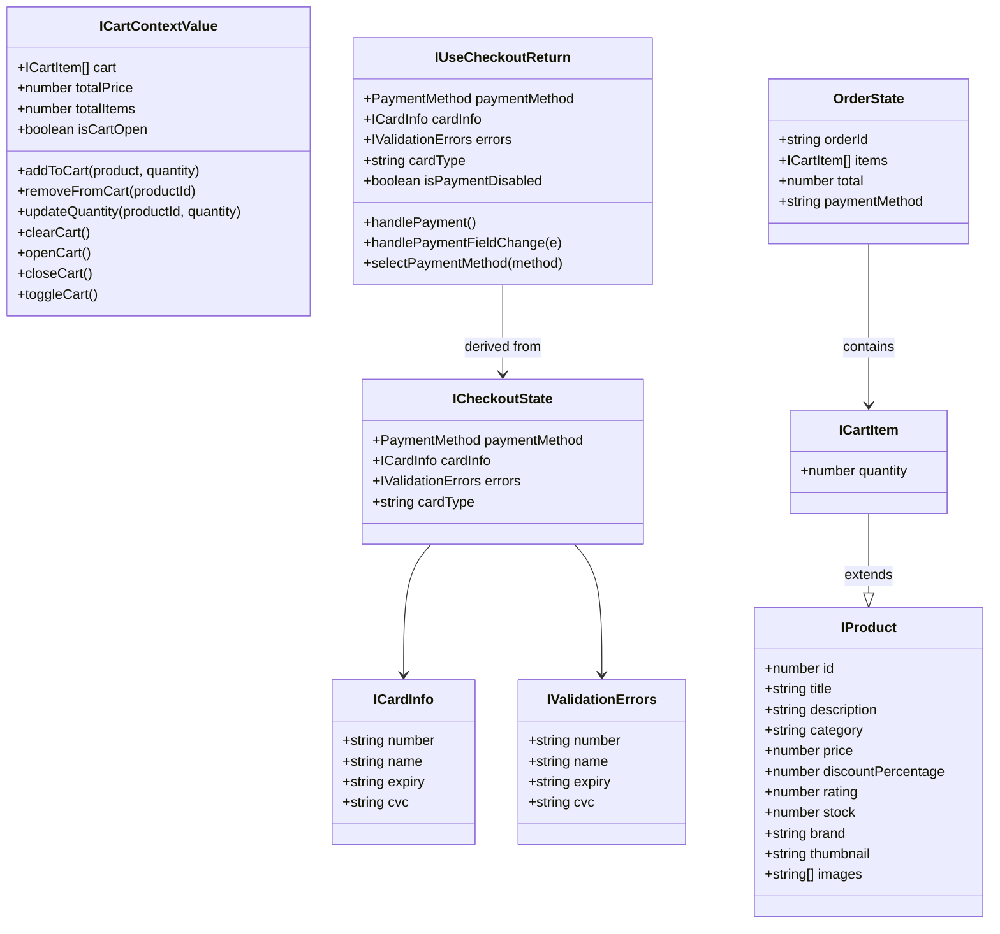
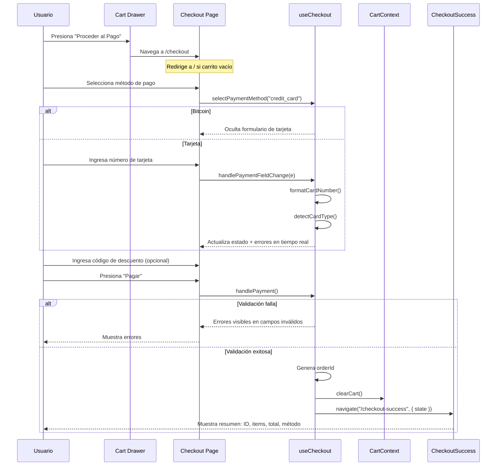
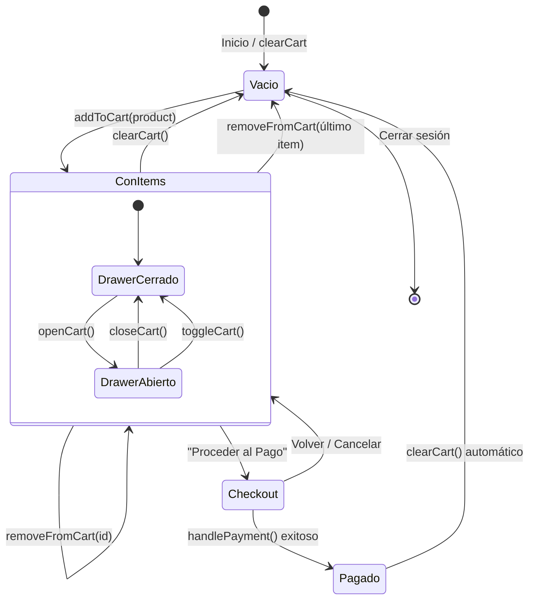
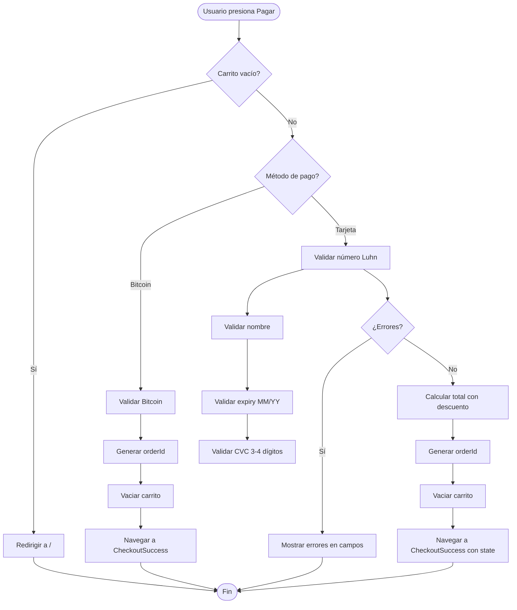
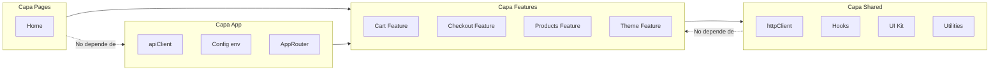

# Diagramas UML

Diagramas de clases, secuencia, estados y actividad según el estándar UML 2.5 (*UML Distilled*, Martin Fowler).

---

## 1. Diagrama de Clases (Domain Model)

Entidades del dominio y sus relaciones.

## 2. Diagrama de Secuencia — Flujo de Checkout

Muestra la interacción temporal entre objetos durante el proceso de pago.

## 3. Diagrama de Estados — Ciclo de Vida del Carrito

Muestra los estados por los que pasa el carrito de compras.

## 4. Diagrama de Actividad — Proceso de Pago

Flujo de actividades del proceso de pago con decisiones y paralelismo.

## 5. Diagrama de Paquetes — Estructura FSD

Muestra la organización en capas y las reglas de dependencia.

