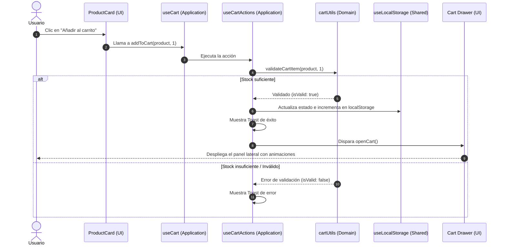

# Módulo de Carrito de Compras (`src/features/cart`)

## 📌 Descripción General

El módulo `src/features/cart` es la feature encargada de gestionar el ciclo de vida completo del **Carrito de Compras** en la aplicación. 

Está construido bajo los principios de la arquitectura **Feature-Sliced Design (FSD)** y **Clean Architecture**, dividiendo sus responsabilidades en 3 capas bien definidas: `domain`, `application` y `presentation`.

---

## 🗂️ Estructura del Módulo

```text
src/features/cart/
├── 🧠 domain/          # Lógica de negocio pura (sin React/UI)
│   ├── cartTypes.ts    # Contratos de interfaces del módulo
│   └── cartUtils.ts    # Funciones matemáticas, de mutación inmutable y validación
│
├── ⚙️ application/     # Orquestación de estado reactivo y React Context
│   ├── CartContext.tsx # Provider global del estado del carrito con persistencia
│   ├── useCart.ts      # Custom hook de entrada pública para consumir el contexto
│   └── hooks/          # Sub-hooks especializados
│       ├── useCartActions.ts  # Acciones de mutación con validación y notificaciones
│       └── useCartDrawer.ts   # Control de visibilidad del drawer lateral
│
└── 🎨 presentation/    # Interfaz de usuario (UI & Animaciones)
    ├── Cart.tsx           # Componente principal (Drawer flotante mediante createPortal)
    ├── CartHeader.tsx     # Encabezado del carrito con botón de cierre (X)
    ├── CartItemRow.tsx    # Fila individual para renderizar cada producto
    ├── CartFooter.tsx     # Pie del carrito con resumen de totales y enlace a checkout
    └── CartEmptyState.tsx # Estado visual cuando el carrito no posee elementos
```

---

## 🔍 Detalle por Capa

### 1. 🧠 Capa de Dominio (`domain/`)
Contiene las reglas de negocio puras. No depende de React, Hooks, DOM ni componentes visuales:
- **`cartUtils.ts`**:
  - `calculateTotal(cart)`: Suma pura del costo total ($).
  - `addItemToCart(cart, product, quantity)`: Retorna un nuevo arreglo inmutable sumando cantidades o agregando ítems.
  - `removeItemFromCart(cart, productId)`: Filtra y remueve un artículo.
  - `validateCartItem(product, quantity)`: Verifica stock disponible y reglas de cantidad antes de alterar el estado.
- **`cartTypes.ts`**:
  - Re-exporta los tipos de la entidad `@entities/cart-item` y `@entities/product`.
  - Define la interfaz `ICartContextValue` que expone el contexto al resto de la app.

### 2. ⚙️ Capa de Aplicación (`application/`)
Orquesta las funciones de dominio con el ciclo de vida de React y el almacenamiento del navegador:
- **`CartContext.tsx`**: Provee el estado global del carrito. Utiliza el hook `useLocalStorage` (`api12-cart-storage`) para persistir automáticamente las selecciones del usuario aunque recargue la página.
- **`useCartActions.ts`**: Centraliza los handlers de modificación (`addToCart`, `removeFromCart`, `updateQuantity`, `clearCart`) integrando toasts interactivos (`react-hot-toast`).
- **`useCartDrawer.ts`**: Controla el estado booleano de apertura (`isCartOpen`) y funciones de alternancia (`openCart`, `closeCart`, `toggleCart`).
- **`useCart.ts`**: Custom hook expuesto para consumir el contexto de manera sencilla y segura:
  ```tsx
  const { cart, addToCart, totalPrice } = useCart();
  ```

### 3. 🎨 Capa de Presentación (`presentation/`)
Componentes gráficos construidos con **Tailwind CSS v4** y **Framer Motion**:
- **`Cart.tsx`**: Drawer deslizable desde la derecha que se renderiza fuera del árbol DOM habitual mediante `createPortal`. Soporta cierre al hacer clic en el backdrop o presionar la tecla `Escape`.
- **`CartItemRow.tsx`**: Representa cada producto con controles de cantidad `+` y `-`, cálculo individual y botón para eliminar.
- **`CartFooter.tsx`**: Muestra el cálculo acumulado e inicia la navegación hacia la ruta `/checkout`.
- **`CartEmptyState.tsx`**: Presentación visual sugerente cuando la lista de compras está vacía.

---

## 🔄 Flujo de Datos: Agregar un Producto al Carrito



---

## ⚡ Métricas de Rendimiento & Optimización

1. **Memoización de Cálculos**: Los montos totales (`totalPrice`, `totalItems`) usan `useMemo` para evitar recálculos en re-renders no relacionados.
2. **Callbacks Estables**: Las funciones de manipulación emplean `useCallback` para mantener una referencia limpia a través de los componentes hijos.
3. **Imprimible/Modular**: Al estar aislado en `/features/cart`, cualquier cambio en el carrito no impacta directamente los componentes de catálogo ni el flujo de pago.
