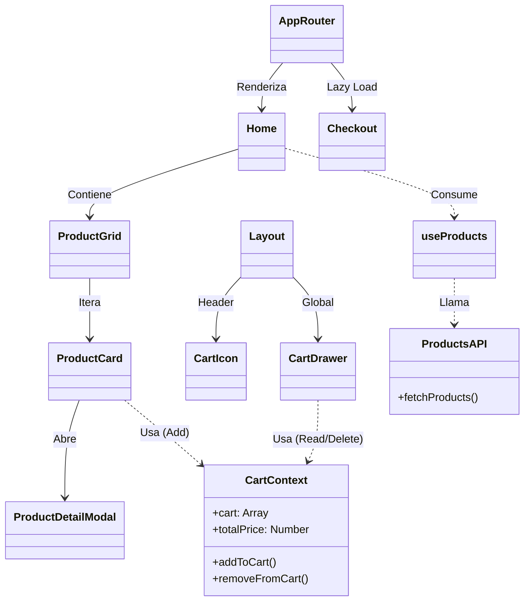

# Arquitectura y Diseño Técnico

## 1. Estructura del Proyecto (Feature-Based Architecture)

La decisión arquitectónica central de este proyecto es la organización por **Features (Características)**. A diferencia de la estructura tradicional agrupada por "tipo" (controllers, views, models), aquí agrupamos por **Dominio de Negocio**.

```
src/
├── features/               # 📦 DOMINIOS DE NEGOCIO
│   ├── modules/            # (Ej: cart, checkout, products)
│   │   ├── application/    # Lógica de Negocio (Hooks, Context, UseCases)
│   │   ├── domain/         # (Implícito) Modelos y Tipos
│   │   ├── infrastructure/ # Comunicación externa (API, LocalStorage)
│   │   └── presentation/   # UI (Componentes, Páginas, Estilos)
├── components/             # 🧱 COMPONENTES COMPARTIDOS (UI Genérica)
├── context/                # 🌐 ESTADO GLOBAL TRANSVERSAL (Theme)
├── routes/                 # 🛣️ RUTAS Y NAVEGACIÓN
└── utils/                  # 🛠️ UTILIDADES PURAS
```

## 2. Definición de Capas (Clean Architecture)

Dentro de cada _Feature_, aplicamos una separación de responsabilidades estricta:

### A. Capa de Presentación (`presentation/`)

-   **Responsabilidad:** Renderizar la UI y capturar eventos del usuario.
-   **Regla:** No debe contener lógica de negocio compleja ni llamadas directas a APIs.
-   **Componentes:** `ProductGrid`, `Cart`, `CheckoutForm`.
-   **Estilos:** Implementa CSS Modules o BEM (via `index.css`).

### B. Capa de Aplicación (`application/`)

-   **Responsabilidad:** Orquestar el flujo de datos y contener la lógica de uso.
-   **Regla:** Conecta la UI con la Infraestructura. Gestiona el estado.
-   **Elementos:** Custom Hooks (`useProducts`, `useCheckout`), Contextos (`CartContext`).

### C. Capa de Infraestructura (`infrastructure/`)

-   **Responsabilidad:** Comunicación con el mundo exterior.
-   **Regla:** Solo aquí se hacen llamadas `fetch` o `axios`.
-   **Elementos:** `productsApi.js`.

## 3. Justificación de Decisiones Técnicas

### ¿Por qué Feature-Based?

-   **Escalabilidad:** Permite que el equipo crezca sin conflictos. Un desarrollador puede trabajar en `Cart` sin tocar `Products`.
-   **Eliminación:** Borrar una feature es borrar una carpeta. No deja código "zombie" disperso por toda la app.
-   **Cohesión:** Todo lo relacionado con una funcionalidad está junto.

### ¿Por qué CSS BEM + Tailwind?

-   Tailwind es excelente para desarrollo r√°pido, pero ensucia el HTML (`class="flex px-4 py-2 bg-red-500..."`).
-   **Solución:** Usar `@apply` en archivos CSS para crear clases semánticas BEM (`.btn--danger`).
-   **Resultado:** HTML limpio (`class="btn--danger"`) y la potencia de Tailwind mantenida.

### Lazy Loading en Rutas

Se utiliza `React.lazy` y `Suspense` en el `AppRouter`.

-   **Motivo:** Rendimiento. El módulo de `Checkout` (que puede ser pesado) no se descarga hasta que el usuario realmente decide comprar.

## 4. Diagrama de Componentes (Mermaid)


```mermaid
classDiagram
    %% Relaciones de Componentes
    AppRouter --> Home : Renderiza
    AppRouter --> Checkout : Lazy Load

    Home --> ProductGrid : Contiene
    ProductGrid --> ProductCard : Itera
    ProductCard --> ProductDetailModal : Abre

    Layout --> CartIcon : Header
    Layout --> CartDrawer : Global

    %% Flujo de Datos
    class CartContext {
        +cart: Array
        +addToCart()
        +removeFromCart()
        +totalPrice: Number
    }

    ProductCard ..> CartContext : Usa (Add)
    CartDrawer ..> CartContext : Usa (Read/Delete)

    class ProductsAPI {
        +fetchProducts()
    }

    useProducts ..> ProductsAPI : Llama
    Home ..> useProducts : Consume
```

## 5. Patrones de Diseño Utilizados

1.  **Provider Pattern:** Para la inyección de dependencias de estado (`CartProvider`, `ThemeProvider`).
2.  **Container/Presenter:** Separación (parcial) lógica en hooks (`useProducts`) y vista (`ProductGrid`).
3.  **Compound Components:** Utilizado internamente por las librerías de UI (Material Tailwind).
4.  **Observer Pattern:** (Implícito) Reactividad del estado mediante Context y Hooks.
