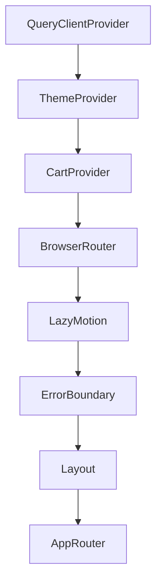

# 🏗️ Arquitectura de Software (Documentación Técnica Completa)

## 1. Arquitectura de Software (Macro)

### 1.1 Single Page Application (SPA)
El sistema está diseñado como una **SPA** utilizando React. Toda la lógica de navegación y renderizado ocurre en el cliente (Client-Side Rendering - CSR).

*   **Justificación de CSR:**
    *   **Interactividad Elevada:** El flujo de compra y gestión del carrito requiere una respuesta inmediata sin recargas de página.
    *   **Costo de Infraestructura:** Al ser una aplicación estática (HTML/JS/CSS), el hosting en GitHub Pages es gratuito y escalable vía CDN.
    *   **SEO:** Dado que es una aplicación de demostración/herramienta interna, el SEO no es la prioridad crítica que justificaría la complejidad de un SSR (Next.js).
*   **Decisiones descartadas:**
    *   **SSR (Next.js):** Descartado para evitar la sobrecarga de un servidor Node.js y mantener la simplicidad del despliegue.
    *   **Microfrontends:** Descartado por el tamaño actual del equipo y del dominio; añadiría una complejidad innecesaria en la orquestación.

## 2. Arquitectura de Frontend (Feature-Based)

Adoptamos una variante de **Feature-Sliced Design (FSD)** simplificada para garantizar que el crecimiento del código sea horizontal y no vertical.

*   **Capas por Feature:**
    *   **Infrastructure:** Adaptadores para el mundo exterior (API calls).
    *   **Application:** Hooks de React, Contextos y lógica que orquestra el estado.
    *   **Domain:** Tipos puros y reglas de negocio independientes de la UI.
    *   **Presentation:** Componentes de React puros que reciben props o usan hooks locales del feature.

## 3. Arquitectura de Datos y Estado

### 3.1 TanStack Query (Server State)
Es el pilar central de la gestión de datos.
*   **Por qué TanStack Query:**
    *   **Abstracción de Fetching:** Elimina `useEffect` repetitivos para llamadas a API.
    *   **Cache Inteligente:** Implementa `stale-while-revalidate` automáticamente.
    *   **Sincronización:** Maneja reintentos, estados de carga y error de forma nativa.
*   **Estado Local vs Global:**
    *   **Context API:** Reservado para estados UI transversales (Carrito, Tema).
    *   **useState/useReducer:** Para estados efímeros dentro de componentes.

## 4. Arquitectura de Componentes

### 4.1 Patrón Container/Presentational (Evolucionado)
Aunque React moderno prefiere Hooks, mantenemos la separación conceptual:
*   **Smart Components (Features):** Componentes en la capa `presentation` que consumen hooks de la capa `application`.
*   **Dumb Components (UI Kit):** Componentes en `src/components/ui` que son agnósticos al negocio y solo reciben props de estilo y datos.

### 4.2 Atomic Design (Descartado)
Se decidió NO seguir Atomic Design estrictamente (Atoms, Molecules, Organisms) para evitar la "parálisis por análisis" al clasificar componentes pequeños. En su lugar, usamos una estructura basada en **Composición de Componentes**.

## 5. Arquitectura de Comunicación

### 5.1 Capa de Servicios (ApiClient)
*   **API REST:** Consumo de DummyJSON.
*   **Generic Client:** `apiClient` centralizado que inyecta headers, maneja la `BASE_URL` y captura excepciones HTTP.
*   **Manejo de Errores:** Se utiliza un patrón de propagación de errores hacia los `ErrorBoundary` de React para fallos catastróficos, y estados de error de TanStack Query para fallos controlados de red.

## 6. Arquitectura de Proveedores (Provider Hierarchy)

### 6.1 Orden de Providers en App.tsx
El orden de los providers en el componente raíz es crítico para el correcto funcionamiento de la aplicación.

### 6.2 Jerarquía de Proveedores

| Orden | Provider | Dependencia | Función |
|-------|----------|-------------|---------|
| 1 | `QueryClientProvider` | Ninguna | Caché de datos, TanStack Query |
| 2 | `ThemeProvider` | Ninguna | Tema claro/oscuro |
| 3 | `CartProvider` | ThemeProvider | Estado global del carrito |
| 4 | `BrowserRouter` | Context Providers | Navegación SPA |
| 5 | `LazyMotion` | BrowserRouter | Animaciones optimizadas |
| 6 | `ErrorBoundary` | LazyMotion | Captura errores de render |
| 7 | `Layout` | ErrorBoundary | Estructura UI (Navbar + Outlet) |
| 8 | `AppRouter` | Layout | Definición de rutas |

### 6.3 Justificación del Orden

1. **QueryClientProvider primero**: No depende de nada, pero todo depende de él para datos
2. **ThemeProvider antes de BrowserRouter**: Permite que componentes usen hooks de tema antes de navegar
3. **CartProvider dentro de ThemeProvider**: El carrito puede necesitar acceder al tema
4. **BrowserRouter dentro de los contexts**: Los componentes dentro de las rutas pueden usar los contextos
5. **ReactQueryDevtools al final**: Herramienta de debug, no necesita el router
