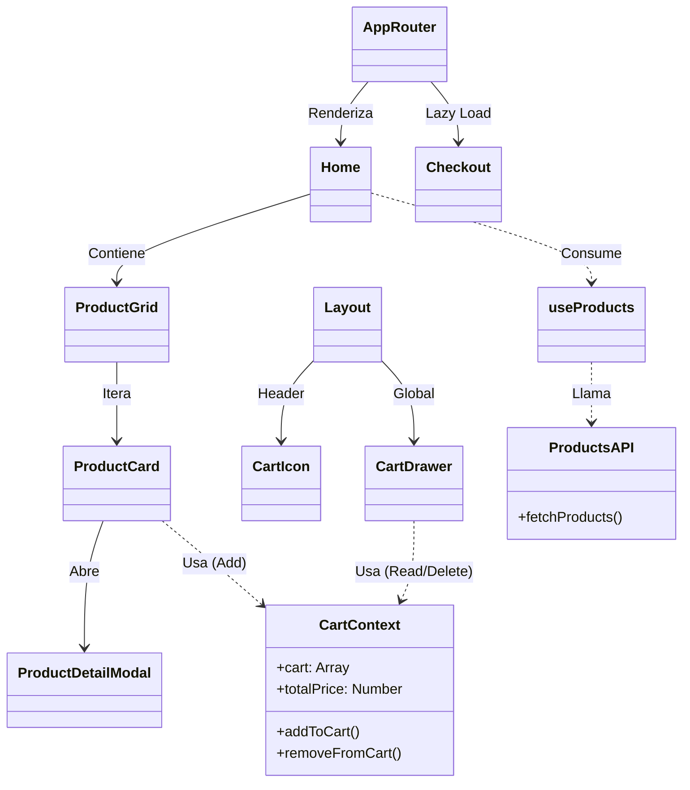
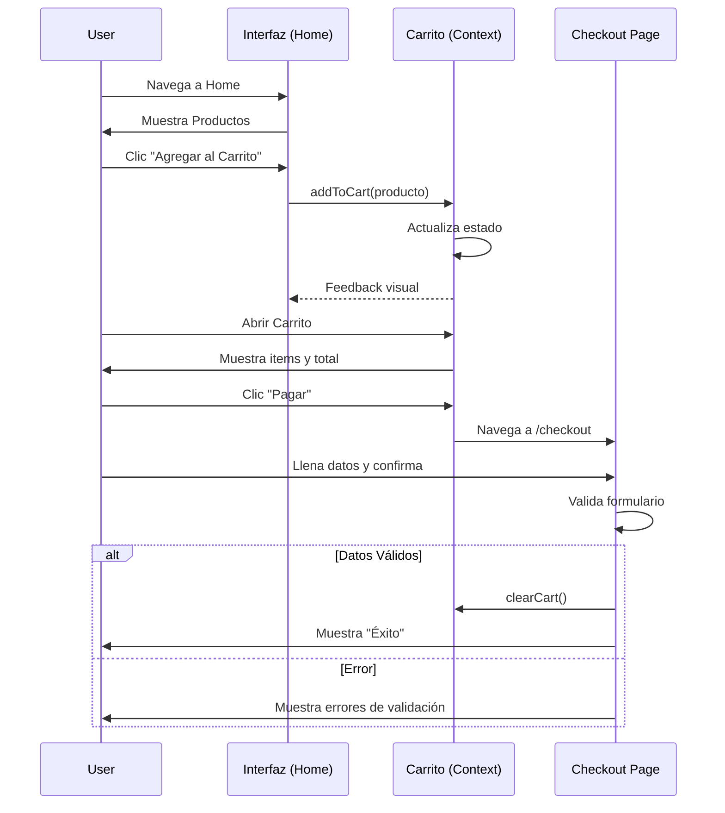

# Diagnóstico Técnico del Proyecto React

**Fecha de Análisis:** 20 de Diciembre de 2025
**Proyecto:** MyProjectAPI12
**Versión:** 0.0.0 (Alpha)

## 1. Resumen Ejecutivo

El proyecto `MyProjectAPI12` es una Single Page Application (SPA) de comercio electrónico construida sobre el ecosistema de React. Tras una reciente refactorización arquitectónica, el sistema ha evolucionado de una estructura monolítica dispersa a una **Arquitectura Basada en Features (Feature-Based Architecture)**, alineándose con estándares modernos de la industria.

El código muestra un nivel de madurez técnica **medio-alto**, destacando por la clara separación de responsabilidades y el uso de patrones de diseño sólidos. Sin embargo, al ser una fase temprana, existen dependencias de implementación (como servicios mockeados) y áreas pendientes de optimización (persistencia, testing).

## 2. Puntos Fuertes Detectados

### 2.1 Arquitectura y Diseño

-   **Modularidad (Feature-Based):** La división en `features/cart`, `features/checkout` y `features/products` permite una escalabilidad horizontal excelente. Cada módulo encapsula su lógica, vistas e infraestructura.
-   **Clean Architecture (Capas):** Se observa una intencionalidad clara en la separación de capas (`presentation`, `application`, `infrastructure`), lo que desacopla la UI de la lógica de negocio y las fuentes de datos.
-   **Gestión de Estado Eficiente:** Uso correcto de Context API (`CartContext`) para el estado global necesario, evitando el "prop drilling" excesivo sin recurrir a librerías complejas (Redux) innecesariamente para esta escala.

### 2.2 Calidad de Código y Estilos

-   **Sistematización CSS (BEM + Tailwind):** La estrategia de extraer clases de utilidad a componentes BEM en `index.css` via `@apply` resuelve el problema de legibilidad común en Tailwind, resultando en un JSX mucho más limpio y semántico.
-   **Patrones de React:** Implementación correcta de `React.memo`, `useMemo` y `useCallback` para optimizar renderizados. Uso de Lazy Loading para división de código.

### 2.3 Stack Tecnológico

-   Uso de **Vite** como bundler, garantizando tiempos de desarrollo rápidos.
-   Inclusión de **Material Tailwind** para componentes base accesibles y estéticos.
-   Estándares modernos de JavaScript (ES6+).

## 3. Riesgos Técnicos y Deuda Técnica

### 3.1 Deuda Técnica Identificada

-   **Persistencia de Datos (Crítico):** El estado del carrito de compras es volátil; se pierde al recargar la página. Se requiere implementar persistencia en `localStorage` o base de datos.
-   **Cobertura de Pruebas (Alto):** Ausencia de tests unitarios y de integración. Cualquier refactorización futura conlleva riesgo de regresiones.
-   **Gestión de Errores Global:** El manejo de errores es local por feature. Falta una estrategia global (Error Boundaries) para capturar fallos no controlados en la UI.
-   **Hardcoding:** Aunque mínimo, pueden existir configuraciones (URLs de API) que deberían estar en variables de entorno `.env`.

### 3.2 Riesgos de Escalabilidad

-   **Dependencia de `DummyJSON`:** La capa de infraestructura depende directamente de la estructura de respuesta de una API pública de terceros. Se recomienda un adaptador (Mapper) más estricto entre la API y el modelo de dominio del frontend para evitar acoplamiento fuerte.
-   **Context API Performance:** Si el estado global crece considerablemente, el uso de un solo Context para todo el carrito podría causar re-renderizados innecesarios en componentes hijos.

## 4. Oportunidades de Mejora

### 4.1 Corto Plazo

1.  **Persistencia del Carrito:** Implementar `useLocalStorage` hook para sincronizar el estado del carrito.
2.  **Mappers de Dominio:** Crear funciones transformadoras en la capa de `infrastructure` para normalizar los datos que vienen de la API.
3.  **Variables de Entorno:** Mover `https://dummyjson.com` a `VITE_API_URL`.

### 4.2 Largo Plazo

1.  **Testing Strategy:** Implementar Vitest + React Testing Library. Priorizar tests en la capa de `application` (hooks de lógica).
2.  **TypeScript:** Evaluar la migración a TypeScript para ganar seguridad de tipos estática, crucial en sistemas financieros/e-commerce.
3.  **CI/CD:** IMPLEMENTADO. Se ha configurado GitHub Actions para validación (lint) y despliegue automático.

## 5. Conclusión del Diagnóstico

El proyecto se encuentra en un estado saludable y preparado para escalar. La base arquitectónica es sólida. Los esfuerzos inmediatos deben centrarse en la robustez (persistencia, manejo de errores) y la calidad asegurada (testing). La documentación que se generará a continuación es el paso correcto para formalizar este conocimiento y facilitar el "onboarding" de futuros desarrolladores.

# Visión General del Sistema (Overview)

## 1. Propósito del Proyecto

**MyProjectAPI12** es una plataforma de **Comercio Electrónico (E-commerce)** diseñada para ofrecer una experiencia de compra fluida, rápida y moderna. Su objetivo principal es demostrar la implementación de arquitecturas de software avanzadas en el desarrollo Frontend con React, sirviendo como base escalable para aplicaciones comerciales reales.

El sistema permite a los usuarios:

-   Explorar un catálogo de productos paginado y optimizado.
-   Consultar detalles específicos de cada artículo.
-   Gestionar un carrito de compras dinámico (agregar, eliminar, vaciar).
-   Simular un proceso de pago (Checkout) con validaciones en tiempo real.

## 2. Alcance Funcional

El alcance actual del sistema (Versión MVP - Producto Mínimo Viable) incluye:

-   **Módulo de Catálogo (Products):** Listado dinámico consumiendo API externa, paginación, modales de detalle y control de stock visual.
-   **Módulo de Compras (Cart):** Gestión de estado global, cálculo automático de totales y drawer (panel lateral) interactivo.
-   **Módulo de Pago (Checkout):** Formulario con validaciones de tarjeta de crédito, selección de métodos de pago y simulación de éxito.
-   **Gestión de Preferencias:** Cambio de tema (Claro/Oscuro) en tiempo real.

## 3. Tecnologías Utilizadas

| Categoría         | Tecnología            | Versión | Propósito                                          |
| :---------------- | :-------------------- | :------ | :------------------------------------------------- |
| **Core**          | **React**             | 18.x    | Biblioteca principal de UI.                        |
| **Build Tool**    | **Vite**              | 5.x     | Empaquetado y servidor de desarrollo ultrarrápido. |
| **Lenguaje**      | **JavaScript**        | ES6+    | Lógica del cliente.                                |
| **Estilos**       | **Tailwind CSS**      | 3.x     | Framework de utilidades CSS.                       |
| **Metodología**   | **BEM**               | -       | Convención de nombres para mantenibilidad CSS.     |
| **Routing**       | **React Router**      | 6.x     | Navegación SPA (Single Page Application).          |
| **UI Components** | **Material Tailwind** | 2.x     | Componentes base accesibles.                       |
| **Iconografía**   | **React Icons**       | 5.x     | Iconos vectoriales optimizados.                    |

## 4. Arquitectura General

El sistema sigue una **Arquitectura Híbrida** que combina:

1.  **Feature-Based Architecture:** Organización vertical por módulos de negocio.
2.  **Clean Architecture (Capas):** Separación horizontal (Presentación, Aplicación, Infraestructura) dentro de cada feature.

### Diagrama de Arquitectura de Alto Nivel

```mermaid
graph TD
    subgraph "Cliente (Navegador)"
        UI[Interfaz de Usuario React]
        Store[Context API (Estado Global)]
        Router[React Router DOM]
    end

    subgraph "Servicios Externos"
        API[DummyJSON API]
    end

    UI --> Store
    UI --> Router
    Store --> API : Fetch Data
    Router --> UI : Render Page
```

## 5. Flujo Principal de la Aplicación

1.  **Inicio (Home):** El usuario aterriza en la página principal. El sistema solicita productos a la capa de infraestructura.
2.  **Interacción (Catálogo):** El usuario ve productos. Los componentes de presentación (`ProductCard`) renderizan la información.
3.  **Acción (Agregar al Carrito):** Al hacer clic, se dispara una acción en la capa de aplicación (`useCart` / `CartContext`).
4.  **Estado Global:** El contexto actualiza el carrito y recalcula totales. La UI del Drawer se actualiza reactivamente.
5.  **Navegación (Checkout):** El usuario procede al pago. El Router carga el módulo de Checkout bajo demanda (Lazy Loading).
6.  **Finalización:** Tras validar el formulario, se muestra la confirmación y se reinicia el flujo.

# Arquitectura y Diseño Técnico

## 1. Estructura del Proyecto (Feature-Based Architecture)

La decisión arquitectónica central de este proyecto es la organización por **Features (Características)**. A diferencia de la estructura tradicional agrupada por "tipo" (controllers, views, models), aquí agrupamos por **Dominio de Negocio**.

```
src/
├── features/               # 📦 DOMINIOS DE NEGOCIO
│   ├── modules/            # (Ej: cart, checkout, products)
│   │   ├── application/    # Lógica de Negocio (Hooks, Context, UseCases)
│   │   ├── domain/         # (Implícito) Modelos y Tipos
│   │   ├── infrastructure/ # Comunicación externa (API, LocalStorage)
│   │   └── presentation/   # UI (Componentes, Páginas, Estilos)
├── components/             # 🧱 COMPONENTES COMPARTIDOS (UI Genérica)
├── context/                # 🌐 ESTADO GLOBAL TRANSVERSAL (Theme)
├── routes/                 # 🛣️ RUTAS Y NAVEGACIÓN
└── utils/                  # 🛠️ UTILIDADES PURAS
```

## 2. Definición de Capas (Clean Architecture)

Dentro de cada _Feature_, aplicamos una separación de responsabilidades estricta:

### A. Capa de Presentación (`presentation/`)

-   **Responsabilidad:** Renderizar la UI y capturar eventos del usuario.
-   **Regla:** No debe contener lógica de negocio compleja ni llamadas directas a APIs.
-   **Componentes:** `ProductGrid`, `Cart`, `CheckoutForm`.
-   **Estilos:** Implementa CSS Modules o BEM (via `index.css`).

### B. Capa de Aplicación (`application/`)

-   **Responsabilidad:** Orquestar el flujo de datos y contener la lógica de uso.
-   **Regla:** Conecta la UI con la Infraestructura. Gestiona el estado.
-   **Elementos:** Custom Hooks (`useProducts`, `useCheckout`), Contextos (`CartContext`).

### C. Capa de Infraestructura (`infrastructure/`)

-   **Responsabilidad:** Comunicación con el mundo exterior.
-   **Regla:** Solo aquí se hacen llamadas `fetch` o `axios`.
-   **Elementos:** `productsApi.js`.

## 3. Justificación de Decisiones Técnicas

### ¿Por qué Feature-Based?

-   **Escalabilidad:** Permite que el equipo crezca sin conflictos. Un desarrollador puede trabajar en `Cart` sin tocar `Products`.
-   **Eliminación:** Borrar una feature es borrar una carpeta. No deja código "zombie" disperso por toda la app.
-   **Cohesión:** Todo lo relacionado con una funcionalidad está junto.

### ¿Por qué CSS BEM + Tailwind?

-   Tailwind es excelente para desarrollo rápido, pero ensucia el HTML (`class="flex px-4 py-2 bg-red-500..."`).
-   **Solución:** Usar `@apply` en archivos CSS para crear clases semánticas BEM (`.btn--danger`).
-   **Resultado:** HTML limpio (`class="btn--danger"`) y la potencia de Tailwind mantenida.

### Lazy Loading en Rutas

Se utiliza `React.lazy` y `Suspense` en el `AppRouter`.

-   **Motivo:** Rendimiento. El módulo de `Checkout` (que puede ser pesado) no se descarga hasta que el usuario realmente decide comprar.

## 4. Diagrama de Componentes (Mermaid)



## 5. Patrones de Diseño Utilizados

1.  **Provider Pattern:** Para la inyección de dependencias de estado (`CartProvider`, `ThemeProvider`).
2.  **Container/Presenter:** Separación (parcial) lógica en hooks (`useProducts`) y vista (`ProductGrid`).
3.  **Compound Components:** Utilizado internamente por las librerías de UI (Material Tailwind).
4.  **Observer Pattern:** (Implícito) Reactividad del estado mediante Context y Hooks.

# Casos de Uso del Sistema

## 1. Actores y Roles

-   **Usuario Visitante (Guest):** Persona que navega por la tienda sin necesidad de autenticación previa.
-   **Sistema (System):** Backend simulado y lógica de frontend que procesa las solicitudes.

## 2. Mapa de Casos de Uso

| ID        | Nombre del Caso de Uso              | Actor Principal   | Prioridad |
| :-------- | :---------------------------------- | :---------------- | :-------- |
| **CU-01** | Visualizar Catálogo de Productos    | Usuario Visitante | Alta      |
| **CU-02** | Ver Detalle de Producto             | Usuario Visitante | Media     |
| **CU-03** | Agregar Producto al Carrito         | Usuario Visitante | Alta      |
| **CU-04** | Gestionar Carrito (Eliminar/Vaciar) | Usuario Visitante | Media     |
| **CU-05** | Realizar Checkout (Pago)            | Usuario Visitante | Alta      |
| **CU-06** | Cambiar Tema (Oscuro/Claro)         | Usuario Visitante | Baja      |

---

## 3. Especificación Detallada de Flujos

### CU-01: Visualizar Catálogo de Productos

**Descripción:** El sistema muestra una lista paginada de productos disponibles.

-   **Precondición:** El usuario accede a la ruta `/` (Home).
-   **Flujo Principal:**
    1.  El sistema detecta la carga de la página.
    2.  `useProducts` solicita datos a la API.
    3.  El sistema muestra indicadores de carga (`SkeletonGrid`).
    4.  El sistema renderiza la grilla de productos (`ProductGrid`).
    5.  El usuario hace scroll y solicita más productos ("Cargar más").
-   **Flujo Alterno (Error de Red):**
    1.  La API falla o retorna 500.
    2.  El sistema muestra un mensaje de error amigable en la UI.

### CU-03: Agregar Producto al Carrito

**Descripción:** El usuario añade un artículo para su compra futura.

-   **Flujo Principal:**
    1.  Usuario hace clic en "Add to Cart" en una tarjeta o modal.
    2.  El sistema valida el stock disponible (simulado).
    3.  El sistema actualiza el estado global `cart` en `CartContext`.
    4.  El sistema muestra una notificación visual o abre el Drawer del carrito.
    5.  El sistema recalcula el subtotal automáticamente.

### CU-05: Realizar Checkout (Pago)

**Descripción:** Proceso de finalización de compra.

-   **Precondición:** El carrito no debe estar vacío.
-   **Flujo Principal:**
    1.  Usuario hace clic en "Checkout" desde el Carrito.
    2.  El sistema navega a `/checkout`.
    3.  Usuario selecciona método de pago (Visa, Mastercard, Bitcoin).
    4.  Usuario completa los datos de la tarjeta.
    5.  Usuario confirma el pago.
    6.  El sistema valida formato de tarjeta (Luhn, longitud).
    7.  El sistema muestra pantalla de "Éxito" y limpia el carrito.
-   **Reglas de Negocio:**
    -   No se pueden ingresar caracteres no numéricos en el campo de tarjeta.
    -   La fecha de expiración debe ser futura.

---

## 4. Diagrama de Flujo (Mermaid)



# Especificación de Requerimientos

## 1. Requerimientos Funcionales (RF)

| ID        | Requerimiento            | Descripción                                                       | Criterio de Aceptación                                                    |
| :-------- | :----------------------- | :---------------------------------------------------------------- | :------------------------------------------------------------------------ |
| **RF-01** | **Listado de Productos** | El sistema debe listar productos obtenidos de una API externa.    | Debe mostrarse imagen, título y precio. Paginación funcional.             |
| **RF-02** | **Detalle de Producto**  | El usuario debe poder ver la descripción completa de un producto. | Al hacer clic en "Ver más", se abre un modal con descripción y stock.     |
| **RF-03** | **Gestión de Carrito**   | El sistema debe permitir añadir y quitar productos.               | El contador de items y el precio total deben actualizarse en tiempo real. |
| **RF-04** | **Validación de Pago**   | El formulario de pago debe validar los inputs antes de procesar.  | Número de tarjeta 19 dígitos, fecha MM/YY válida, CVC numérico.           |
| **RF-05** | **Tema Oscuro**          | El usuario puede alternar entre modo claro y oscuro.              | La preferencia persiste durante la sesión y cambia los colores base.      |

## 2. Requerimientos No Funcionales (RNF)

| ID         | Categoría          | Descripción                                                              | Métrica / Objetivo                                              |
| :--------- | :----------------- | :----------------------------------------------------------------------- | :-------------------------------------------------------------- |
| **RNF-01** | **Rendimiento**    | El tiempo de carga inicial (FCP) debe ser bajo.                          | < 1.5 segundos en 4G. (Uso de Lazy Loading).                    |
| **RNF-02** | **Usabilidad**     | La interfaz debe ser intuitiva y responsive.                             | Funcional en móviles (320px) hasta escritorio (1920px+).        |
| **RNF-03** | **Mantenibilidad** | El código debe seguir estándares de Clean Code.                          | Arquitectura Feature-Based y CSS BEM implementados.             |
| **RNF-04** | **Escalabilidad**  | La arquitectura debe soportar nuevos módulos sin refactorizar el núcleo. | Añadir una feature no debe implicar modificar otras existentes. |

## 3. Requerimientos Técnicos

1.  **Framework:** React v18+.
2.  **Lenguaje:** JavaScript ES6+ (con miras a migración TypeScript).
3.  **Estilos:** Tailwind CSS v3.
4.  **API:** Consumo mediante `fetch` estándar (sin librerías externas pesadas como Axios para este alcance, aunque es viable migrar).
5.  **Entorno:** Node.js v18+ para desarrollo y build.

## 4. Reglas de Negocio

-   **RN-01 (Stock):** No se puede añadir al carrito una cantidad mayor al stock disponible de un producto.
-   **RN-02 (Persistencia):** _[Pendiente]_ El carrito debería persistir si el usuario cierra la pestaña (actualmente volátil).
-   **RN-03 (Moneda):** Todos los precios se manejan y muestran en Dólares Americanos (USD).

# Flujo de Datos y Gestión del Estado

## 1. Modelo de Datos Principal

El sistema maneja dos tipos de datos principales:

1.  **Datos Efímeros (UI State):** Estado de carga (`loading`), errores, formularios abiertos, filtros.
2.  **Datos de Dominio:** Productos, Carrito de Compras, Orden de Pago.

### Entidades Core

#### Producto (Product)

```typescript
interface Product {
    id: number;
    title: string;
    price: number;
    description: string;
    category: string;
    image: string;
    rating: { rate: number; count: number };
}
```

#### Item de Carrito (CartItem)

Extiende de `Product` añadiendo cantidad.

```typescript
interface CartItem extends Product {
    quantity: number;
}
```

## 2. Gestión del Estado (State Management)

### A. Estado Global (Context API)

Utilizamos `Context API` para datos que deben ser accesibles por componentes distantes en el árbol.

-   **`CartContext`:** Almacena el array de ítems del carrito y las funciones modificadoras (`addToCart`, `removeFromCart`).
    -   _Justificación:_ Evita pasar props desde `App` hasta `CartDrawer` o `ProductCard`.
-   **`ThemeContext`:** (Si implementado) Controla el tema visual (light/dark).

### B. Estado Local (Hooks)

Utilizamos `useState` y `useReducer` para lógica encapsulada en features.

-   **`useProducts` (Hook de Aplicación):**
    -   Maneja: `products` (data), `loading` (boolean), `error` (string).
    -   Lógica: Fetching de datos al montar el componente.

### C. Estado de Formularios

-   **CheckoutForm:** Maneja el estado de los inputs (tarjeta, nombre) de forma local controlada.

## 3. Diagrama de Flujo de Datos (Data Flow)

El flujo de datos sigue el patrón **Unidireccional** de React.

```mermaid
flowchart TD
    API[API Externa]
    Infrastructure[Layer: Infrastructure]
    Application[Layer: Application (Hooks)]
    Context[Global Store (Context)]
    UI[Layer: Presentation]

    %% Fetching Data
    API -->|JSON Response| Infrastructure
    Infrastructure -->|Normalized Data| Application
    Application -->|State Update| UI

    %% User Action (Add to Cart)
    UI -->|Event: onClick| Context
    Context -->|Action: dispatch| Context
    Context -->|New State| UI
```

## 4. Servicios y APIs

### `productsApi.js`

Capa de abstracción para `fetch`.

-   **Entrada:** Parámetros de paginación (`limit`, `skip`).
-   **Salida:** Promesa con datos JSON crudos.
-   **Transformación:** Actualmente directa, pero punto de extensión para Mappers.

### Estrategia de Carga (Fetching Strategy)

-   **Fetch-on-render:** Los datos se solicitan cuando el componente (`Home`) se monta.
-   **Pagination:** Carga incremental (Load More) concatenando resultados al estado existente.

# Guía para Desarrolladores (Developer Guide)

Esta guía está diseñada para nuevos desarrolladores que se unen al equipo de **MyProjectAPI12**.

## 1. Instalación y Configuración

### Prerrequisitos

-   Node.js v18.0.0 o superior.
-   Gestor de paquetes `npm` o `pnpm` (recomendado).
-   Git.

### Pasos Iniciales

1.  **Clonar el repositorio:**
    ```bash
    git clone <url-repositorio>
    cd myprojectapi12
    ```
2.  **Instalar dependencias:**
    ```bash
    pnpm install
    ```
3.  **Iniciar servidor de desarrollo:**
    ```bash
    pnpm dev
    ```
    El servidor iniciará en `http://localhost:5173`.

## 2. Scripts Disponibles

En el `package.json` encontrarás:

| Script    | Comando        | Descripción                                                        |
| :-------- | :------------- | :----------------------------------------------------------------- |
| `dev`     | `vite`         | Inicia el servidor de desarrollo con HMR (Hot Module Replacement). |
| `build`   | `vite build`   | Compila el proyecto para producción en la carpeta `/dist`.         |
| `preview` | `vite preview` | Sirve la versión compilada localmente para probar el build.        |
| `lint`    | `eslint ...`   | Ejecuta el linter para buscar errores de código.                   |

## 3. Convenciones del Proyecto

### Estándares de Código

-   **Estilos:** No usar estilos inline ni CSS puro fuera de `index.css`. Usar clases BEM definidas via `@apply`.
-   **Componentes:** Functional Components con Hooks.
-   **Nombres:**
    -   Componentes: `PascalCase` (Ej: `ProductCard.jsx`).
    -   Funciones/Hooks: `camelCase` (Ej: `useCart.js`).
    -   Clases CSS: `kebab-case` BEM (Ej: `product-card__title`).

### Estructura para Nuevos Módulos

Si vas a crear una nueva feature (ej: `Auth`), sigue esta estructura:

```
src/features/auth/
├── application/     # AuthProvider, useAuth
├── infrastructure/  # authApi (login, register)
└── presentation/    # LoginForm, RegisterPage
```

## 4. Flujo de Trabajo (Git Workflow)

1.  Nunca trabajar directamente en `main`.
2.  Crear rama por feature/fix: `feature/login-page` o `fix/cart-calculation`.
3.  Hacer Pull Request (PR) y solicitar revisión.

## 5. Buenas Prácticas Recomendadas

-   **DRY (Don't Repeat Yourself):** Si copias y pegas código, extráelo a una utilidad o componente común.
-   **KISS (Keep It Simple):** Evita la sobre-ingeniería. No añadas Redux si un Context basta.
-   **Separation of Concerns:** Componentes de vista no deben hacer llamadas `fetch`. Usa hooks.
-   **Validación:** Usa `PropTypes` en todos los componentes que reciban propiedades.

# Calidad, Riesgos y Mantenibilidad

## 1. Estrategia de Calidad

La calidad en **MyProjectAPI12** se sostiene sobre tres pilares:

### A. Arquitectura Limpia

La separación de responsabilidades facilita la prueba y modificación de componentes sin efectos colaterales. Al desacoplar la API de la vista, podemos cambiar de proveedor de datos sin romper la UI.

### B. Análisis Estático (Linting)

Se utiliza **ESLint** con reglas estándar para React.

-   Previene errores comunes (variables no usadas, dependencias de hooks faltantes).
-   Asegura consistencia de estilo.

### C. Accesibilidad y UI

Uso de **Material Tailwind** y etiquetas semánticas HTML5.

-   Asegura contraste adecuado y estructura navegable por teclado.

## 2. Deuda Técnica Actual

| Ítem               | Severidad | Descripción                                             | Plan de Mitigación                                      |
| :----------------- | :-------- | :------------------------------------------------------ | :------------------------------------------------------ |
| **Persistencia**   | Alta      | El carrito se pierde al refrescar (F5).                 | Implementar `localStorage` en `CartContext`.            |
| **Testing**        | Media     | Cobertura de tests al 0%.                               | Configurar Vitest + RTL y testear flujos críticos.      |
| **Mappers API**    | Baja      | Acoplamiento directo a la estructura JSON de DummyJSON. | Crear capa de transformación en `infrastructure`.       |
| **Hardcoded Text** | Baja      | Textos fijos en código (sin i18n).                      | Extraer textos a archivo de constantes o librería i18n. |

## 3. Análisis de Riesgos

### R1. Dependencia de API Externa

-   **Riesgo:** Si `dummyjson.com` cae o cambia su esquema, la app deja de funcionar.
-   **Impacto:** Crítico.
-   **Mitigación:** Implementar un adaptador (Adapter Pattern) en `infrastructure` que intercepte y normalice los errores o datos.

### R2. Rendimiento en Listados Grandes

-   **Riesgo:** Renderizar miles de productos en el DOM puede congelar el navegador.
-   **Impacto:** Medio (UX pobre).
-   **Mitigación:** Implementar "Virtualización" (React Window) si el catálogo crece significativamente.

## 4. Recomendaciones Futuras (Roadmap de Calidad)

1.  **Integración Continua (CI):** ✅ IMPLEMENTADO. GitHub Actions corre linter y build en cada Push.
2.  **Husky + Lint-Staged:** Impedir commits que no pasen las reglas de calidad.
3.  **Monitoreo de Errores:** Integrar Sentry para trackear errores en producción.
4.  **Optimización de Imágenes:** Implementar carga adaptativa de imágenes (WebP, tamaños dinámicos).

# Cierre del Proyecto y Próximos Pasos

**Fecha de Cierre de Iteración:** 20 de Diciembre de 2025

## 1. Estado Actual del Sistema

El proyecto **MyProjectAPI12** ha alcanzado con éxito su fase de MVP (Producto Mínimo Viable) con una arquitectura refactorizada y robusta.

-   ✅ **Arquitectura:** Migración a Feature-Based completada.
-   ✅ **Estilos:** Sistema BEM + Tailwind implementado y documentado.
-   ✅ **Funcionalidad:** Flujos de Catálogo, Carrito y Checkout operativos.
-   ✅ **Documentación:** Set completo de guías técnicas generado (00-08).

## 2. Limitaciones Conocidas

Aunque funcional, el sistema presenta limitaciones propias de una versión Alpha:

1.  La "compra" es una simulación; no procesa pagos reales.
2.  No existe autenticación de usuarios ni historial de órdenes.
3.  La persistencia de datos es volátil (memoria del navegador).

## 3. Lecciones Aprendidas

-   **Valor de la Arquitectura:** Invertir tiempo en separar capas (`presentation` vs `application`) simplificó enormemente la refactorización de estilos posterior.
-   **Eficacia de BEM:** Aplicar BEM sobre Tailwind eliminó el ruido visual en los componentes React, haciendo el código mucho más legible.
-   **Importancia del Lazy Loading:** Fundamental para mantener el bundle inicial ligero, especialmente al añadir módulos pesados como Checkout.

## 4. Roadmap Futuro

### Q1 2026 - Fase de Robustez

-   [ ] Implementar persistencia (LocalStorage / IndexedDB).
-   [ ] Añadir Tests Unitarios (al menos 60% de cobertura).
-   [x] Configurar CI/CD Pipeline básico. (Implementado Dic 2025)

### Q2 2026 - Fase de Funcionalidad

-   [ ] Módulo de Autenticación (Login/Register).
-   [ ] Historial de Compras del Usuario.
-   [ ] Integración con pasarela de pagos real (Stripe Sandbox).

---

**Firma:**
_Equipo de Arquitectura y Desarrollo Frontend_
**MyProjectAPI12**
