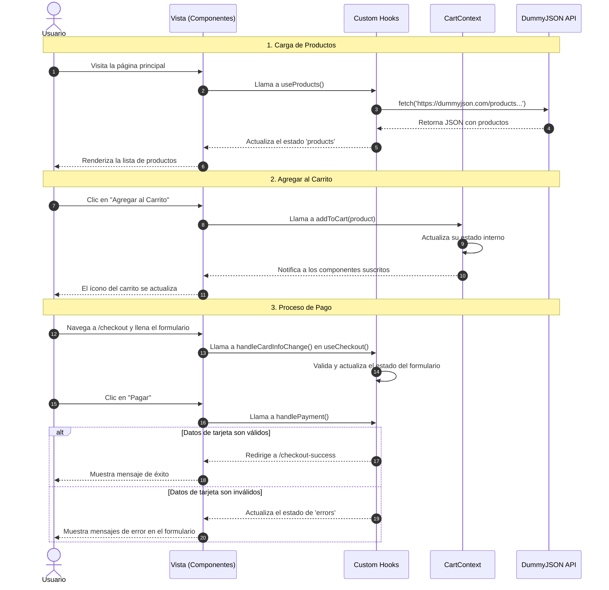

# 🛠️ Especificación Técnica del Software

## 1. Arquitectura y Patrones de Diseño

Este proyecto implementa una arquitectura moderna de frontend basada en principios de **Clean Architecture**, adaptados a un entorno de React.

### 1.1. Arquitectura por Capas (Adaptada a React)

La estructura del proyecto se organiza por *features* (`products`, `cart`, `checkout`), promoviendo la **separación de conceptos (SoC)** y la modularidad.

-   **Capa de UI (Componentes):** Componentes de React puros y presentacionales. Su única responsabilidad es renderizar la UI y delegar eventos. (`ProductGrid.jsx`, `Cart.jsx`).
-   **Capa de Lógica de UI (Hooks):** Custom Hooks que encapsulan la lógica de estado, efectos y manejo de eventos. Actúan como *presenters* o *controllers*. (`useProducts.js`, `useCheckout.js`).
-   **Capa de Estado Global (Context):** Contextos de React que gestionan el estado compartido entre diferentes *features*. (`CartContext.jsx`, `ThemeContext.jsx`).
-   **Capa de Servicios (Abstracción de API):** Aunque el `fetch` se realiza actualmente en el hook `useProducts`, la estructura prevé una capa de servicio (`src/features/products/services/products.js`) para aislar completamente las llamadas de red, permitiendo un fácil reemplazo o mocking.

### 1.2. Patrones de Diseño Aplicados

-   **Custom Hook Pattern:** Para encapsular y reutilizar la lógica con estado. Es el pilar de la arquitectura.
-   **Provider Pattern (via Context API):** Para la inyección de dependencias y la gestión de estado global (`CartProvider`, `ThemeProvider`).
-   **Module Pattern:** Agrupación de archivos por funcionalidad (`features`) para mejorar la cohesión y reducir el acoplamiento.
-   **Reducer Pattern (via `useReducer`):** Utilizado en `useCheckout` para manejar transiciones de estado complejas de forma predecible y robusta.

---

## 2. Diagramas de Flujo (UML)

### 2.1. Diagrama de Casos de Uso

```mermaid
graph TD
    actor Cliente
    subgraph "Plataforma E-Commerce"
        uc1["Explorar Catálogo"]
        uc2["Gestionar Carrito"]
        uc3["Realizar Pago"]
        uc4["Ver Detalle de Producto"]
        uc5["Cambiar Tema (Light/Dark)"]
    end

    Cliente -- uc1
    Cliente -- uc2
    Cliente -- uc3

    uc1 --|> uc4 : include
    uc2 --|> uc1 : include
    uc3 --|> uc2 : include
```

### 2.2. Diagrama de Secuencia del Flujo de Compra

Este diagrama ilustra la interacción entre el usuario, la UI, la lógica de la aplicación y la API externa.



---

## 3. Software y Tecnologías Aplicadas

| Categoría         | Tecnología / Librería        | Propósito                                                                      |
| :---------------- | :--------------------------- | :----------------------------------------------------------------------------- |
| **Core Framework**| React 18                     | Biblioteca principal para la construcción de la interfaz de usuario.           |
| **Build Tool**    | Vite                         | Herramienta de desarrollo y empaquetado extremadamente rápida.                  |
| **Enrutamiento**  | React Router DOM             | Para la navegación y gestión de rutas en la Single Page Application (SPA).     |
| **UI Components** | Material Tailwind            | Biblioteca de componentes de UI que combina Material Design con Tailwind CSS.  |
| **Estilos**       | Tailwind CSS                 | Framework CSS de utilidad para un diseño rápido y personalizable.              |
| **Linting**       | ESLint                       | Para mantener la calidad y consistencia del código JavaScript.                 |
| **API Externa**   | DummyJSON                    | API pública para obtener datos de productos de prueba.                         |

---

## 4. Análisis del Proyecto

### 4.1. Nivel de Dificultad y Complejidad

-   **Nivel General:** Intermedio.
-   **Justificación:** El proyecto va más allá de un simple "to-do list". Implementa conceptos que requieren una comprensión sólida de React y del desarrollo de software, tales como:
    -   **Gestión de Estado Avanzada:** Uso combinado de `useState`, `useContext` y `useReducer` según la complejidad del caso.
    -   **Custom Hooks:** Abstracción de toda la lógica de negocio, que es una práctica de nivel intermedio/avanzado.
    -   **Code-Splitting:** Uso de `React.lazy` y `Suspense` para optimizar la carga inicial de la aplicación.
    -   **Arquitectura Cohesionada:** La estructura basada en *features* demuestra una planificación arquitectónica deliberada.

### 4.2. Nivel del Proyecto en el Ecosistema React

-   **Nivel:** **Sólido Prototipo Profesional.**
-   **Análisis:** Este proyecto sirve como una excelente base para una aplicación de producción. No es un simple ejercicio académico. Demuestra las mejores prácticas actuales del ecosistema React (hooks, context, vite) y una arquitectura que es mantenible y escalable.

### 4.3. Puntos a Mejorar para Producción

1.  **Persistencia del Carrito:** Actualmente, el carrito se pierde al refrescar la página. Se debe implementar persistencia usando `localStorage` o, idealmente, sincronizándolo con una base de datos en el backend.
2.  **Integración de Pasarela de Pago Real:** Reemplazar la simulación de pago con una integración real a servicios como Stripe o PayPal.
3.  **Autenticación de Usuarios:** Añadir un flujo de inicio de sesión para que los usuarios puedan ver su historial de pedidos.
4.  **Testing:** Aunque la arquitectura facilita las pruebas, no se han implementado tests unitarios (con Jest/Vitest y React Testing Library) ni E2E (con Cypress/Playwright).
5.  **Separación de la Capa de Servicio:** Mover formalmente todas las llamadas `fetch` a la capa de servicios para un desacoplamiento total.
